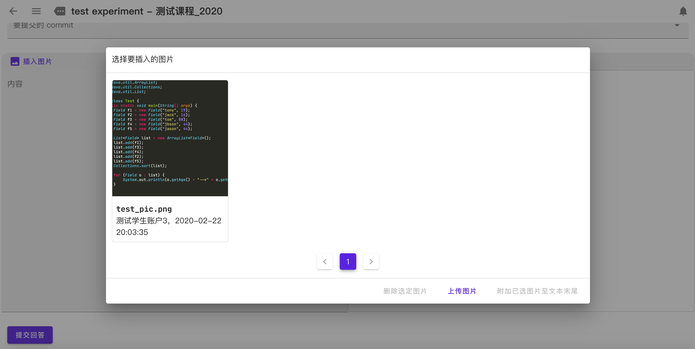
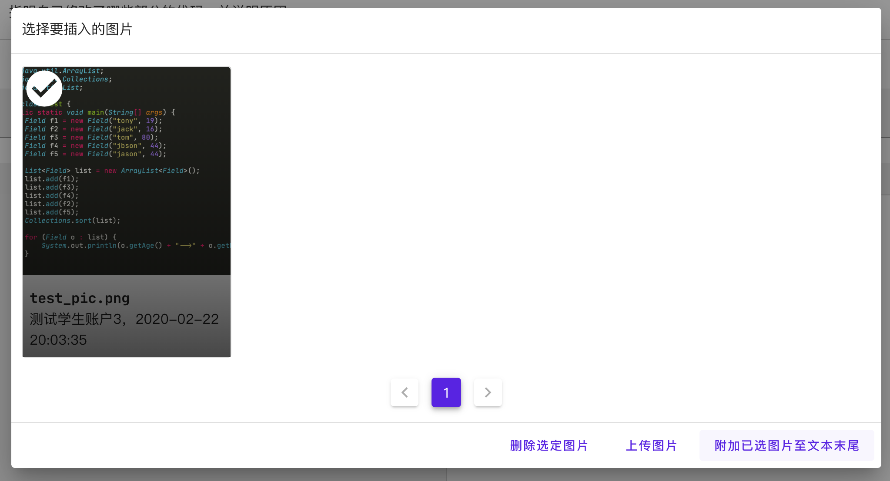
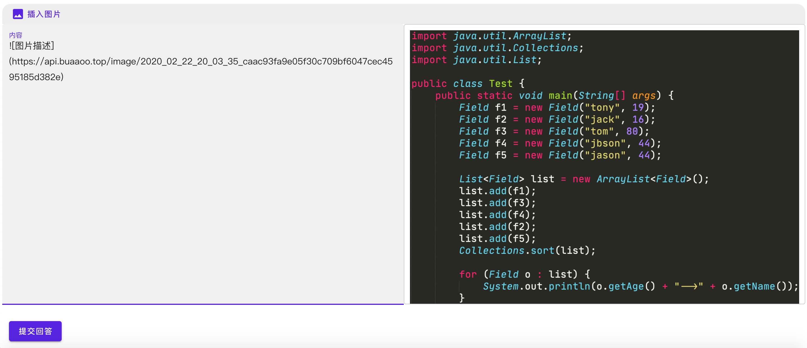

# 讨论区

​	讨论区是针对 《面向对象程序先导》 课程设置的沟通场所，同学们可以在这里提出与本课程相关的问题，这些问题将由老师和助教团队为同学们解答，同时，同学们也可以在这里进行合理的探讨。请注意，除了讨论区，我们不会在其他任何地方回答课程相关问题哦：）

## 讨论区模式介绍

- 讨论区分为两部分，作业内容答疑区和公共讨论区。作业内容答疑区是每次作业对应一个小的答疑区，其中讨论针对作业内容和评测要求的问题，助教会对其中有意义的部分进行解答，这也是课程团队和同学们沟通的**最主要**途径。公共讨论区是对课程规则理解，评测系统使用，技术交流问题的讨论区，对于规则和系统，助教会给予解答，技术交流，则更加希望同学们能积极参与，我们希望能够诞生出所谓 《面向对象程序先导》 讨论区的“大 V”。

- 助教答疑的时间模式为统一答疑，轮流值班。课程组保证在规定时间截止前完成所有累积有意义问题的回答。

- 所有规则应**以规则书，指导书，讨论区中的官方认证帖为准**，讨论区中其他的讨论只能视作讨论者个人的看法，不作为最终规定（助教在非官方认证帖中的口糊错误也不能作为最终规定）。

- 对于助教未回答或回复”no response"的答疑帖，包括但不限于有以下几种原因：

  - 已经有类似的帖子，助教已经做出了回答并在置顶帖中更新。
  - 这个问题不在本次课程考核范围之内，我们保证评测不会涉及这个方面。
  - 这个问题的提问表述不清楚或指导书中有明确说明。

  换言之，作业将在指导书规定的约束条件范围内来进行，我们欢迎同学们就不明确的地方在讨论区提出疑问，就自己的小感悟小思考在讨论区分享。

  我们希望培养大家的综合面向对象程序设计和开发能力，也希望通过高质量的讨论区让同学们收获知识、解决共性疑问，而非拘泥某个小细节，纠结于一分两分的成绩。

- 除此之外，课程团队也会不定期发布一些科普贴和技术分享帖，希望能帮助大家学到更多元化的知识。当然，也欢迎同学们多多做类似的工作。

- 在课程结束前，我们会对讨论区中贡献大的同学给予一定的奖励。

## 讨论区生存法则（必须）

- 禁止任何无意义的水贴，比如发布表情包，商业互吹等，或者是散布未经证实的消息或者发泄个人情绪，助教团队有权对这类行为作出最终解释并给予处罚。对于水贴本身，我们会进行水贴标记并禁止对该贴的回复。
- 禁止低意义的提问，我们希望培养大家提出高质量问题的能力，对于那些虽然和课程相关，但是无效或者几乎没有意义的问题，我们是希望尽量避免的，我们会在初期对于这样的情况给予引导，但是如果有长期低意义提问的情况发生，我们也会采取措施进行处理。对于低意义贴本身，我们会进行低意义标记并禁止对该贴的回复。

## 讨论区生存法则（建议）

### 如何提问

#### 在你开始提问前

- 请确保问题与本课程相关。
- 在规则书，指导书，讨论区官方认证帖中都没有找到可以给你提供帮助的内容。
- 请确定你经过深思熟虑后，仍然非常疑惑。
- 请先尝试使用 Google、Baidu、StackOverflow 寻求解答，尝试从讨论区的其他问题中寻找答案，或尝试询问你的同学等。
- 若以上均未能解决你的疑惑，那么恭喜你！可以按照以下流程进行提问了。

#### 选择合适的标题

​	拒绝标题党和无厘头标题，类以下形式的提问很有可能被助教团队无视：

- 【de 了 8 个小时，原来是...】

- 【多线程灵异事件！】

- 【跪求大神代码！重酬！】

​	我们鼓励一语中的的提问，提问的正确打开方式应该是这样的：

- 【关于多线程出现死锁的问题】

    同时，为了使讨论区管理方便，我们建议同学们在帖子的题目前加上如下前缀：

    **针对作业内容答疑区**

- 作业内容，请使用“【作业内容】”

- 评测要求，请使用“【评测要求】”

   **针对公共讨论区**

- 课程规则，请使用“【课程规则】“

- 系统使用，请使用”【系统使用】“

- 技术交流，请使用”【技术交流】“

#### 理性的问题描述

​	请大家在问题描述一栏理性地、礼貌地、清晰地、简明地描述你的问题。

- 请大家在撰写问题描述时，不要带有任何负面情绪，更不可带有诽谤、攻击他人的倾向：）
- 描述问题时，应该尽可能清晰、详细，但是不宜过于冗长、繁琐。
- 如遇非常非常难以描述的问题，可以用一个例子来描述，否则尽可能不要出现过多数据或代码的描述，这样可以节省大家的时间。

### 如何回答

​	当你准备回答一个问题时，请理性地、礼貌地、清晰地、简明地描述你的答案。

- 请务必确保你的回答是确定的，如果是没有足够把握的回答，请一定要表示“你也不确定”的事实。
- 请勿发表没有意义的言论（如：“不愧是大佬 orz”），**请不要在讨论区宣泄你的情绪，请不要对提问者进行语言和人身攻击**。
- 对于一些“不好”的提问，请不要指责提问者，相反，请你耐心地指出他们的错误所在并细心引导，对于描述模糊的问题，你可以提出追问。
- 对于一些“显然”的问题，比如问题涉及指导书已明确规定的内容或讨论区已有的公告等，请礼貌地组织语言并明确指出答案来源。
- 对于可通过 Google、Baidu 等方式找到解决方式的问题，请对问题进行简单的回答并给出相应链接。
- 我们鼓励同学们在回答问题之外，提出一些探索性的问题，引出更深刻的讨论。

## 如何完成格式漂亮的讨论区发言

如果你的发言（包括提问、分享、讨论与回答等各式发言）仅有几句话，直接使用普通文本即可，正如同你在微信中的发言。但是，如果你的发言较长且有一定条理性，我们推荐你使用`markdown`来让你的发言格式简洁干练且赏心悦目。

### 如何书写markdown

可以在[Markdown 教程](https://www.runoob.com/markdown/md-tutorial.html)中查看从零入门相关的完善参考资料，掌握他们对聪明的你并不困难:)

### 可能遇到的问题与解决方案

#### 插入图片

讨论区插入图片的流程和逻辑是：上传图片$\rightarrow$附加已选图片到文本末尾$\rightarrow$剪切文本末尾的图床链接，并将其粘贴到合适的位置。

#### 插入emoji

如果你想要插入emoji，直接粘贴一个emoji是不可行的，这会导致你的帖子无法发出。对于这样的需求，解决方案是[在 markdown 中使用表情符号](https://www.jianshu.com/p/31f075f8e118)博客中**使用Unicode**的办法，比如你可以使用`&#x1F600;`来显示&#x1F600;

## 图床的使用

在实验中会遇到需要同学们上传截图的情况，OO课程平台使用图床进行图片上传。

首先将需要上传的截图保存在本地，然后点击作答区域的 `插入图片` 按钮，然后点击 `上传图片`，选择本地图片上传，成功后你将看到如下页面：

在此之后，请务必选择要提交的图片，然后点击 `附加已选图片至文本末尾` ，将其添加到文本中。

最终的效果如下图所示：

作答区域的文本框支持 markdown 和 $\LaTeX$，希望同学们对其加以利用，按照题目要求进行适当排版后提交你的实验报告。
