---
本文档包括：
1. 在学校内访问课程网站
2. 在学校外通过VPN访问OO网站
3. 版本控制工具Git
4. 配置SSH-KEY
5. 代码的提交
6. JDK的安装配置指南
7. IDEA教程
8. Markdown教程
---

# 《面向对象程序先导》工具链介绍

## 在学校内访问课程网站

课程网站：http://oo.buaa.edu.cn/

> 课程网站请通过**统一身份认证**登录

Gitlab：http://gitlab.oo.buaa.edu.cn/

## 在学校外通过VPN访问OO网站

要访问面向对象课程网站和Gitlab需要校内的网站环境。

为了让同学们可以在校外也能使用全部功能，使用**客户端版本的VPN（EasyConnect）**([https://vpn.buaa.edu.cn/](https://vpn.buaa.edu.cn/))是**必要**的。（https://oo.e2.buaa.edu.cn/和https://gitlab-oo.e2.buaa.edu.cn/均有部分功能缺失，并且同学们在校外使用Git推送代码的时候，使用EsayConnect是最方便的方法）

一、按照VPN网站的指示下载安装客户端，保持其在后台运行。


启动客户端的方法有两种，一种是访问网页vpn.buaa.edu.cn，登录完毕之后会自动唤起客户端。另一种是手动打开安装好的EasyConnect软件，在框内输入地址`https://vpn.buaa.edu.cn/`，然后用账号密码登录。

需要特别注意的是，你**不应该**通过点击这个vpn网页上的按钮来进入课程网页！！


二、由于校外的DNS解析不稳定，为防止各种可能的错误，请手动修改hosts文件进行解析。

**Windows用户**以管理员权限打开记事本，打开`C:\Windows\System32\drivers\etc\hosts`文件。没有则新建一个。

**Mac用户和Linux用户**可以使用命令`sudo nano /etc/hosts`编辑它。~~（提示输入密码之后不会回显，输完密码回车即可）~~

请在hosts文件最下方添加这三行文本。

```
10.212.24.81 gitlab.oo.buaa.edu.cn
10.212.25.163 oo.buaa.edu.cn
10.212.25.163 api.oo.buaa.edu.cn
```

三、前两步做完之后你就可以访问课程网站 [http://oo.buaa.edu.cn/](http://oo.buaa.edu.cn/) 和提交代码的GitLab网站 [http://gitlab.oo.buaa.edu.cn/](http://gitlab.oo.buaa.edu.cn/)了，如果不行可以首先尝试重启电脑使hosts文件生效。不建议通过点击VPN网页中**WEB资源**下方的按钮进入网站，我们不保证其功能完全。

## 工具链前言

本课程采用自动化评测，因此为了方便快捷的提交作业，推荐同学们阅读下面的工具链教程，或者直接观看课程组提供的工具链教学视频（**强烈推荐观看视频**）

简单来说，OO课程网站（[https://oo.buaa.edu.cn/](https://oo.buaa.edu.cn/)）是同学们提交评测请求和查看结果的平台，Gitlab（[https://gitlab.oo.buaa.edu.cn/](https://gitlab.oo.buaa.edu.cn/)）则是存储同学们代码的仓库。在进行评测的时候，服务器会自动从Gitlab中抽取你的代码，因此你需要学会将代码上传到Gitlab中，也就是使用Git上传你的代码。

>这一部分对应教程中的：
>
>- 版本控制工具Git
>- 配置SSH-KEY
>- 代码的提交

本课程需要同学们掌握编写Java代码的能力，因此大家需要学会使用JDK，并且强烈推荐使用一个好用的IDE，教程中使用Jetbrains的IDEA作为例子，如果你愿意，也可以使用其他的IDE（例如VSCode）。

> 这一部分对应教程中的：
>
> - JDK安装配置指南
> - IDEA教程

如果你经常阅读博客的话，想必可以看到网页中的博客大多有着非常美观的排版。使用Markdown可以极大的减轻你的排版负担，在几乎不增加撰写时间的同时让文档变得更加美观。OO课程网站的评论区也支持使用Markdown，推荐同学们进行学习。

> 这也部分对应教程中的：
>
> - Markdown教程

**本文档篇幅较长，推荐同学们优先观看工具链教程视频。**

**本文档篇幅较长，推荐同学们优先观看工具链教程视频。**

**本文档篇幅较长，推荐同学们优先观看工具链教程视频。**

**Checkstyle**与**JUnit**部分未在本文档中涉及，但是他们非常重要，不但可以帮助同学们培养良好的编码习惯，还是课程分数的重要组成部分，因此请同学们务必阅读。

> 工具链教程视频：
> https://bhpan.buaa.edu.cn/link/AAE87220770022402E9CAF5FE32389A7D1

> 工具链教程中使用的IDEA是Community版的，该版本完全可以满足本课程的教学需求。
>
> 由于北航的邮箱无法直接申请Jetbrains的教育许可，如果同学们想要使用Ultimate版本的IDEA，可以参照链接：[高校学生免费使用jetbrains产品指南](https://blog.csdn.net/m0_63451989/article/details/131743070)

## 版本控制工具Git

### Git安装

Git是一个开源的分布式版本控制系统，可以高效处理人和或大或小的项目。

何为版本控制？想必大家都遇到过一个文件需要反复修改完善的场景，大量的文件副本不仅浪费大量空间，也会对我们造成一定的困扰。哪一个版本是最终版本？我们这一版相对上一版作了什么修改了？我们要消除修改，又应该回退到哪一个文件？文档如此，代码也如此，因此我们需要借助版本控制工具对文件进行控制。在OO先导及OO课程中，我们采用Git作为版本控制工具提交和管理项目。言归正传，下面开始Git的安装教程！

#### 在Windows上安装Git

首先，我们可以到Git官网（[http://git-scm.com/downloads](http://git-scm.com/downloads)）上直接下载安装程序，然后按照默认选项安装即可。

安装完成后，在开始菜单中找到“Git”->“Git Bash”，蹦出一个类似命令行窗口的东西，就说明Git安装成功！

#### 在Linux上安装Git

如果使用`Debian`或`Ubuntu`，在终端敲入命令`sudo apt-get install git`即可完成git安装。

如果使用`Centos`或`RedHat`，安装命令为`yum -y install git`

#### 配置Git

安装完成后，我们需要配置用户名密码，命令行窗口中输入以下内容配置git

```shell
git config --global user.name "Your Name"
git config --global user.email "email@example.com"
```

### Git使用

在此，我们推荐大家使用廖雪峰的官方网站学习Git

网站链接：https://www.liaoxuefeng.com/wiki/896043488029600

### Git常用命令与常见问题详解

https://juejin.cn/post/6844904191203213326

### 可视化理解Git

基础： https://learngitbranching.js.org/

进阶：https://dev.to/lydiahallie/cs-visualized-useful-git-commands-37p1

### Commit格式规范化

为了规范同学们`git commit`的提交记录，便于同学们进行版本控制，提供以下两种工具。

* IDEA插件：`git commit template`
* `Commitizen`工具

下附相关学习链接：

* Commitizen安装步骤：https://www.jianshu.com/p/36d970a2b4da

* Commitizen解决报错：https://www.jianshu.com/p/75dcfb54392b

* Idea的git commit template插件：https://blog.csdn.net/m0_46636892/article/details/122093889


> 虽然课程组不对你的commit message做检查，但是从现在开始养成好习惯将有诸多益处

## 配置SSH-KEY

这个步骤需要你先对Git有所了解，请首先阅读下面的章节并了解Git的基本用法。

要利用ssh与服务器同步代码，首先是需要创建ssh密钥对，并在GitLab网页端导入公钥。创建ssh密钥对的方式是使用命令

```
ssh-keygen -t rsa -C "youremail@example.com"
```

之后打开`<你的家目录>/.ssh/id_rsa.pub`文件，这就是生成的密钥对中的**公钥**（一般为`*.pub`格式的文件），与之对应的`<你的家目录>/.ssh/id_rsa`文件是**私钥**，公钥是可以随便给别人看的，而**私钥**则必须自己保存好，**不可以发给其他人看**。（其中`<你的家目录>`在Windows中一般指的是`C:\Users\<你的用户名>\`，在Mac中一般指的是`/Users/<你的用户名>`，Linux用户相信你已经知道了。一般情况下.ssh文件夹是隐藏的，可以通过命令行访问或者在地址栏手动输入来进入文件夹。）

在GitLab网页端的`<右上角头像>/偏好设置/SSH密钥`界面导入你的**公钥**。之后就可以通过命令行来访问Git仓库了。下面将进行一个示范。

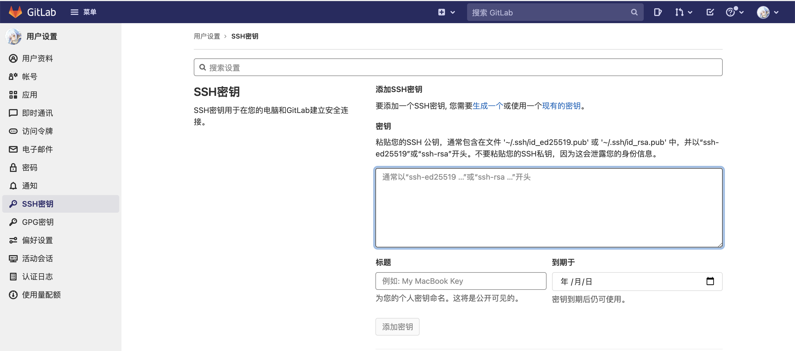

在网页端找到需要克隆的仓库，点击`克隆/使用SSH克隆/复制链接`

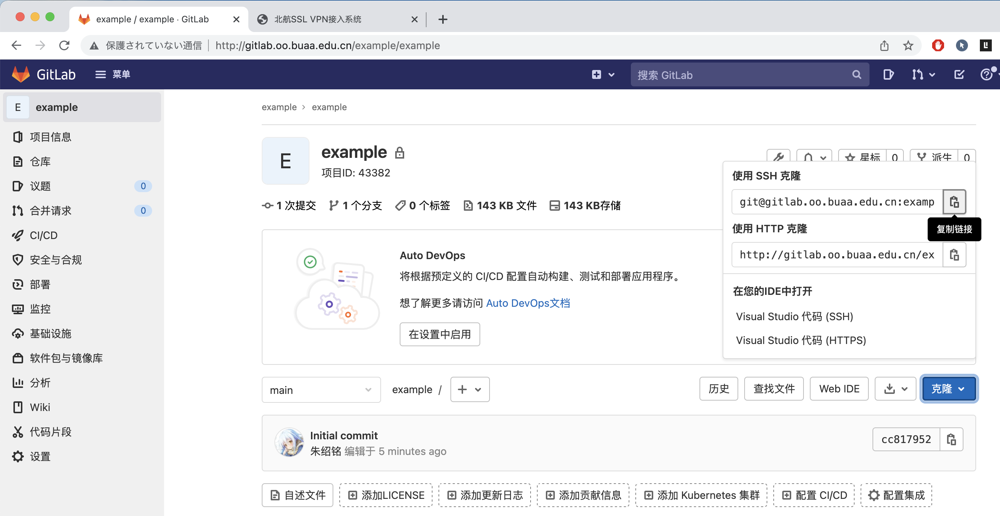

在终端（Unix）或Git Bash（Windows）中使用命令

```
git clone <复制的链接>
```

就可以将仓库克隆到本地了，此时**必须要开启VPN客户端**否则连接会失败。

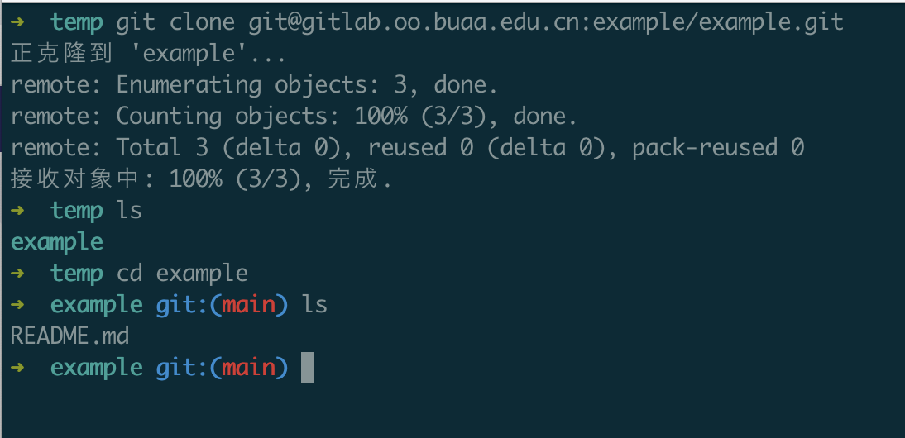

如果以上工作都可以正常进行，那么恭喜你，VPN已经配置成功了。如果出现了任何问题也不要怕，请及时与助教联系。

## 代码的提交

进行到这一步，你应该已经了解了`Git`的基本使用方法，并且成功配置了SSH-KEY，那么接下来你就可以开始着手完成作业了。

登录课程的 GitLab，找到本次实验对应的仓库，并复制本仓库对应的 SSH URL 地址，如下图所示：

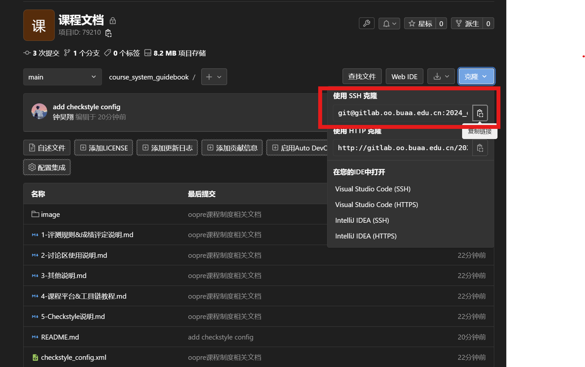

如果你没有使用 SSH，那么请选择 HTTPS，在 push 时需要输入用户名和密码。

如果你已经在本地创建本次作业对应的文件夹，例如 `hw1`，然后打开终端 `/shell/bash` 等，进入此目录，执行：

```
git init
git remote add origin git@gitlab.oo.buaa.edu.cn:oo_2024_homeworks/xxx.git
```

如果你并没有创建文件夹，你可以进入输入下面的指令来克隆远程文件夹，这会帮你直接建立好git存储库

```
git clone git@gitlab.oo.buaa.edu.cn:oo_2024_homeworks/xxx.git
```

之后进入刚刚的工作目录中完成你的代码，当代码完成后，将其push到仓库中：

```
git add .
git commit -m "message"
git push -u origin master
```

然后，登录 OO 课程平台，在对应的实验的最下方作答区域中，点击“要提交的 commit”，从下拉列表中选择要提交的 commit，


完成其他任务后，点击最下方的“提交回答”按钮即可提交对应的代码。

## JDK安装配置指南

JDK是Java Development Kit 的缩写，中文称为Java开发工具包，由SUN公司提供。它为Java程序开发提供了编译和运行环境，所有的Java程序的编写都依赖于它。

在我们开始使用Java编写、运行程序之前，我们首先需要手动配置JDK。下面是JDK的一般配置过程。

### 下载JDK

首先，我们需要在官方网站上下载JDK安装包。

网站链接：[https://www.oracle.com/technetwork/java/javase/downloads/jdk8-downloads-2133151.html](https://www.oracle.com/technetwork/java/javase/downloads/jdk8-downloads-2133151.html)。或者百度搜索JDK，也可以找到官网链接。（**注意：推荐在官方网站上下载。**）

#### 下载版本的选择

##### 对于Windows用户

- 如果你的操作系统字长为64位，则选择Windows x64版本。
- 如果你的操作系统字长为32位，则选择Windows x86版本。

##### 对于Linux或MacOS用户

对于非Windows的用户，则需要按照自己操作系统的类型自行进行选择。

### 安装与配置

#### 安装JDK

直接运行安装下载下来的安装包文件即可。（Linux和MacOS操作类似）

#### 配置环境变量

安装完毕后，我的电脑右键属性，点击左边的`高级系统设置`，点击`高级`-->`环境变量`。

（本部分将围绕windows进行讲解，Linux和MacOS的配置方式可以自行了解）

（MacOS可以尝试直接使用，较新的MacOS版本可能不需要配置环境变量也能正常运行，笔者是18款MacBook pro，可以直接使用。如果不能可以再配置环境变量）

##### JAVA_HOME

在下方系统变量栏中，新建环境变量`JAVA_HOME`。

变量值为`C:\Program Files\Java\jdk1.8.0_101`（具体路径因安装路径而异，不要包含`bin`）。

如下图所示

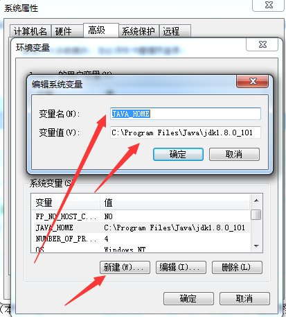

##### CLASSPATH

在系统变量栏中，新建变量`CLASSPATH`，变量值为`.;%JAVA_HOME%\lib;%JAVA_HOME%\lib\dt.jar;%JAVA_HOME%\lib\tools.jar;`。

（注意，一定要留有前面的`.`符号）

如下如所示：

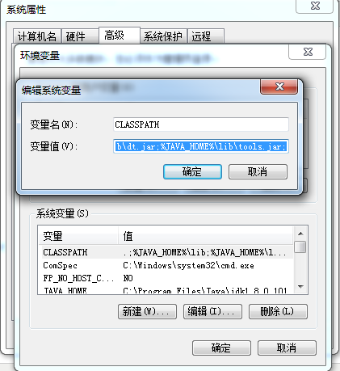

##### PATH

在系统环境变量中，设置`PATH`，变量值`%JAVA_HOME%\bin;%JAVA_HOME%\jre\bin;`（**不要覆盖掉原本的内容，将这个值加入到`PATH`的最前面**）。

如下图所示：

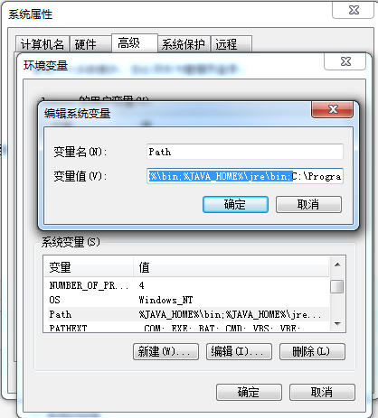

### 其他

#### 常见疑问的解答

##### 如何知道我操作系统（Windows）的字长？

对于Windows10系统，可以右键我的电脑，进入属性，查看即可查看操作系统类型。（具体细节可能略有差异，更多细节可以百度）

对于Linux和MacOS系统，一般也有类似的通过GUI或者命令行的方式查看系统信息，具体可以自行百度。

##### 如何知道是否已经完成了安装呢？

打开`cmd`（Linux或MacOS下的终端），输入`java`，应该出现类似这样的内容。

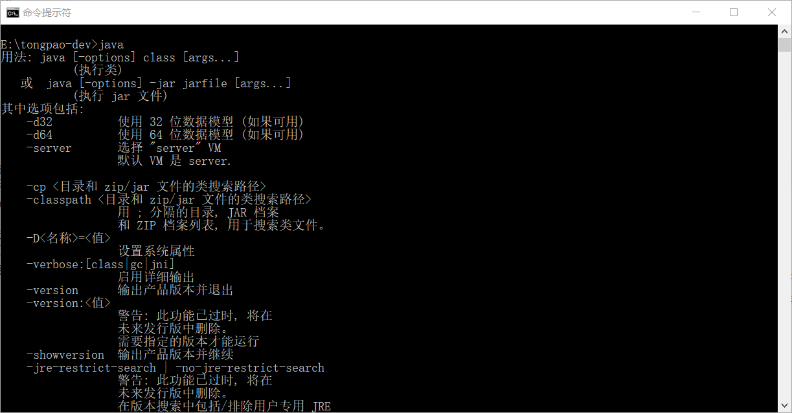

##### 系统评测机使用的Java版本是什么呢？

Java版本：`java -version`

```shell
java version "1.8.0_101"
Java(TM) SE Runtime Environment (build 1.8.0_101-b13)
Java HotSpot(TM) 64-Bit Server VM (build 25.101-b13, mixed mode)
```

Javac版本：`javac -version`

```shell
javac 1.8.0_101
```

##### 是否必须使用官方版本的JDK呢？OpenJDK是否可以呢？

推荐使用官方版本的JDK（不过具体的版本号不需要严格一致，保证是`java 1.8.0`即可）

OpenJDK的话，在绝大部分场合下问题不大，但是课程组没有就所有的细节做过相关的具体测试，故不保证不会出现因为OpenJDK版本问题导致的评测异常，还请大家自行选择判断。（另：如果你是Mac或者Linux用户的话，OpenJDK安装会远比Oracle JDK方便）

## IDEA教程

### 下载安装Idea

初次打开Idea的下载页面，一下子就懵了：


499刀一年。。。看的有些肾疼。那是不是我们Idea之旅就要就此止步了呢？Of course, **NO!**

让我们继续往下看：
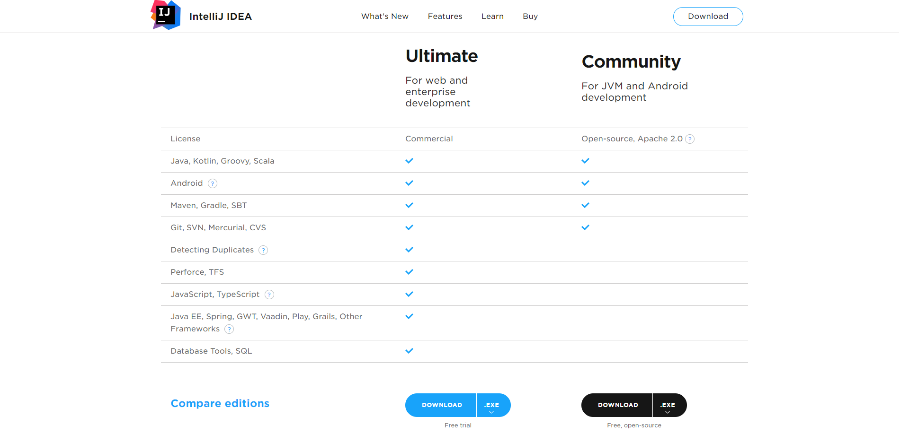

果然，`Intellij Idea`和`Pycharm`一样，都提供了**完全免费的社区版**，可以直接下载使用。

然而，对于本科生，我们依然**可以通过注册学生账号的方式来免费使用Ultimate版**（准确的说，Jetbrains大礼包里面除了完全面向企业的团队工具之外，所有的专业版工具都可以凭学生优惠免费下载使用）

大家可以自己去**按照[官网的引导](https://www.jetbrains.com/student/)或者网上的教程等进行认证操作和许可证的免费申请**，本文中不再赘述。

安装的过程也并不复杂，也没有什么坑点，大家可以自行完成。

>  注：本文中接下来的图片示范均以Ultimate版为例，课程组也推荐按照上述介绍申请许可证使用Ultimate版的Idea

### 使用IDEA

（**在开始本节之前，请一定保证你已经妥善完成了JDK的安装与环境配置**）

初次打开软件时，可能会需要你设置一些风格主题一类的东西，这个按照自己的喜好设置就好（笔者本人力荐`Darcula`黑色风格<del>，通宵爆肝护眼必备</del>），而且在进入软件之后，也可以在Setting中继续进行设置。

创建新工程时，我们只需要按照一般的套路来：`File`-->`New`-->`Project...`


在我们的作业项目中，我们不使用框架，使用原生Java。所以一路Next到最后一步。


在这里，我们需要设置一下项目名，然后点击`Finish`，即可完成项目创建。

接下来，只需要在`src`路径下创建程序文件，并运行即可，如下图所示。


#### 在IDEA中使用Git

除此之外，Idea实际上也像eclipse一样对于git有完美的图形化支持，下面就来简单介绍一下idea中的图形化版本控制(version control)的使用方法。

##### 配置git

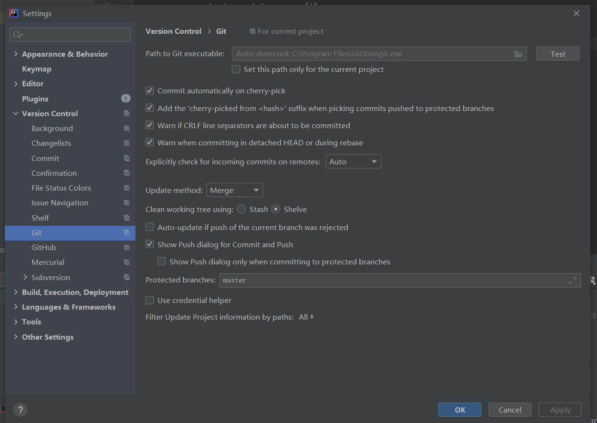

点击**file->setting**找到**version control**中的**Git**，配置git的安装路径。点击`Test`进行测试，成功后点击`Apply`应用配置。

##### 创建仓库


找到`VCS->Enable version Control Integration`打开版本控制，然后选择`git`并确认。


确认后，你会发现左侧边栏中显示的目录下的文件变成**红色**，这说明git初始化成功了。因为这些文件还没有被加入到仓库中，因而暂时是红色的。

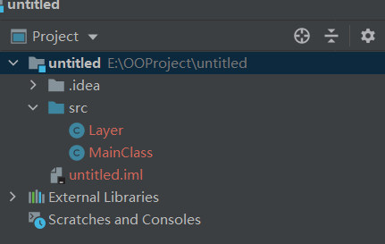

在上边栏右侧，有git的三个快捷键，分别表示`pull`、`commit`和`push`操作。

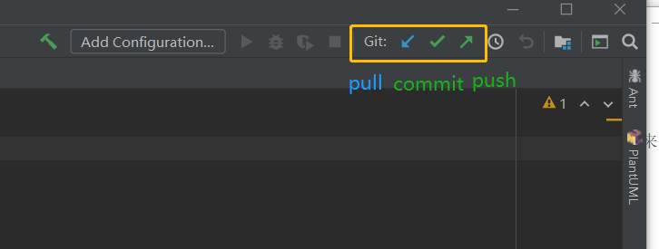

##### commit操作

点击右上方的快捷键中的`commit`按钮，即可进入commit界面（默认在左侧）。


从列表中选择想要`add`的文件，并添加`commit message`，并点击`commit`按钮，即可将选中内容提交至本地仓库。

在提交后，你会发现左侧的工程目录中文件颜色会变成白色，这说明这些文件被成功`commit`了。

##### 文件颜色

文件不同的颜色代表不同的状态，具体情况如下图。（包括<b style = "color: gray">Ignored</b>，<b style = "color: red">Untracked</b>，<b style = "color: lightblue">Unmodified</b>，<b style = "color: lightgreen">Modified</b>）

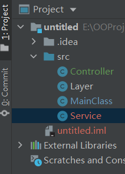

##### 版本树

idea提供图形化版本树，方便用户查看历史版本，并对照版本之间的区别。


##### 远程仓库

点击`VCS->Git->Remote`，即可为本地仓库设置远程仓库。

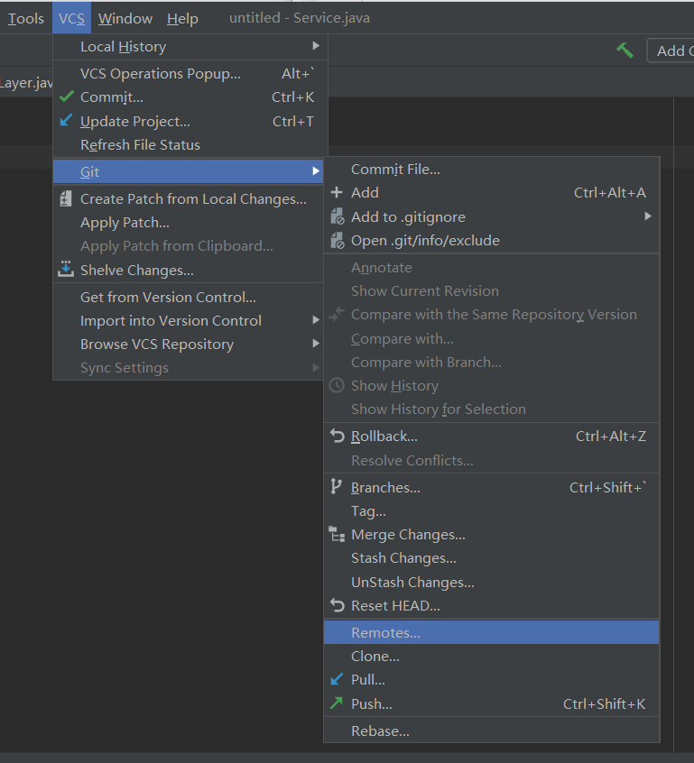

点击`+`号，添加新的远程仓库，URL可以使用`SSH`或`HTTP`等多种形式。在第一次添加时，可能需要输入用户邮箱与密码。

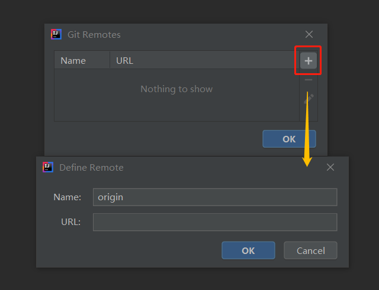

下图是`gitlab`中`URL`的位置，二选一即可。

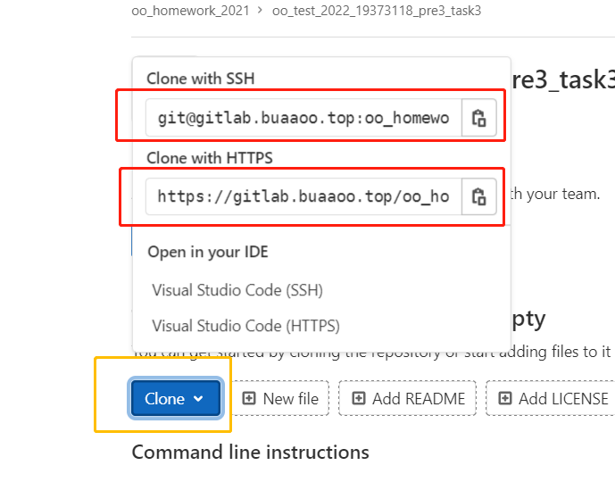

设置好远程仓库后，点击右上角的`push`快捷键，即可将本地仓库中的内容推送至远程仓库。

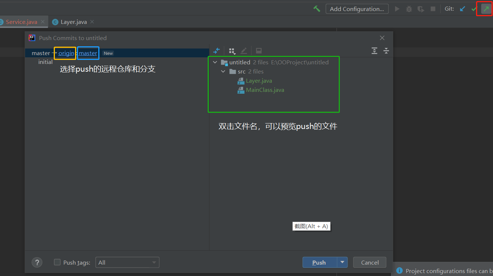

##### 更多

详细idea-git教程请见：https://blog.csdn.net/a749402932/article/details/107148373/

#### 高度智能的联想

说到代码联想，大家可能对这一概念并不陌生。事实上很多的IDE也都已经在支持这一功能了。

但是，等你一用idea的代码联想功能，你就会再也放不下来了。

说到代码联想，大家肯定会很快的想到eclipse的联想功能：


然而，eclipse的代码联想实际上存在一些局限性（以及其他很多的IDE也是这样）：

* **写类名的时候没有联想** 例如，开始写System这个类时，整个过程不会出现任何的联想
* **联想出来的方法快捷键操作不便** 例如，当System按下`.`之后输入`e`，联想到了`exit`，但总还是需要一些比较不优雅的操作（比如鼠标操作，比如并不符合人类直觉的一些其他操作）来快速输入

这意味着什么呢？这意味着，**当你对一门语言或者某些类不够熟悉（甚至根本不知道它们的存在）时，你连自我尝试和探索的可能性都没有**，只能去翻阅冗长且并不友好的java文档，这显然不符合程序猿的探索精神。以及，如此不优雅的快速输入，多年的码农表示怎么用怎么觉得**别扭**。

然而在idea中，这些问题都得到了极大的改善：


* **从输入类名的第一个字起，就可以进行智能的联想** 仔细观察上图的话还可以发现一件有趣的事情，输入`LC`后，连我们的LiftController类都联想到了。是的，idea的代码联想完全支持英文音序联想。
* **根据用户近期使用的情况来智能调节联想顺序** 这是idea代码联想另一个很神奇很贴心的feature，如果你近期频繁使用`LC`来输入LiftController类的话，你会发现LiftController类会在列表中越来越靠前，最多两三次过后就跑到了顶部。
* **可以直接按上下键和回车来进行快速键入** 这一点相比eclipse等其他ide有了非常大的改善，整个过程非常符合一般人的操作直觉，且全过程**不依赖任何键盘以外**的操作。

有了idea强大的代码联想功能（准确的说，jetbrains全家桶IDE都有这些特性），我们的代码产出速度可以大幅度提升。不仅如此，我们还可以**对于并不熟悉或者未知的一些代码或库进行大胆的尝试**，不得不说，这一功能还很适合进行自我探索。

#### import自动添加

在Idea中，我们实际上不需要一条一条在顶上打`import`语句。

我们只需要想到了某个类或者某个方法，直接在程序中写上去，然后ide就会提示该类未导入，就像这样


我们只需要将鼠标或者光标移至该类名上，并使用`Alt`+`Enter`快捷键，从提供的类中选择需要的，完成自动添加。（有时可能只有一个类可供选择，此时将不会出现选择直接完成添加）


#### 批量修改

不知道大家有没有遇到过这样的尴尬状况：

```java
public class Scheduelr {
    // something inside
}
public abstract class Main {
    public static void main(String[] args) {
        Scheduelr s = new Scheduelr();   // execution of the constructor method
        Scheduelr.someStaticMethod();   // execution of the static method
        /*
            LOTS OF CODE HERE THAT USES THE SCHEUDUELR
        */
    }
}
```

没错，细心的你应该已经发现了问题所在——`Scheduelr`类名的拼写是错误的，应该是`Scheduler`。

按照一般的代码规范，这样的拼写错误绝对是不可以容忍的（就算可以容忍，这样的东西也会导致笔者强迫症大犯 -_-||）。

然而，再一看，可能已经有无数的地方已经在用着这个拼写错误的类名调用。想改？烦得很，而且还很容易错改和漏改。不改？强迫症使我面目全非o(╥﹏╥)o。于是，相信很多人最终的选择还是——不改，宁可被自己代码恶心一遍遍也不能有bug。

实际上，idea在这件事情上有很完美的解决方案：
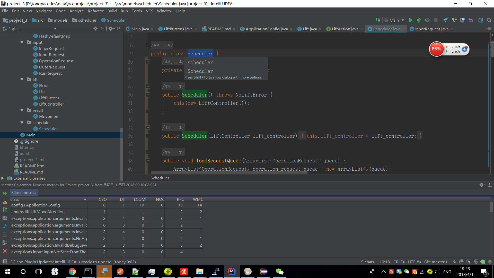

只需要在类名（实际上方法名、变量名、甚至文件名等也都可以这么做）上右键->Refactor->Rename，或者直接`Shift`+`F6`，即可**直接修改名字**，而且**整个工程中相关的地方也都会一起随之改动**。

更有趣的是，笔者做了一个实验：

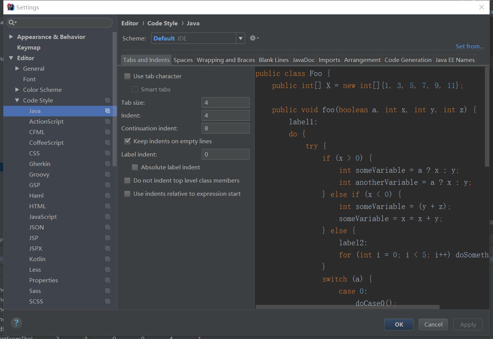

在这样的一个函数中，将第一个for循环内的`x`值进行rename操作，效果如下：

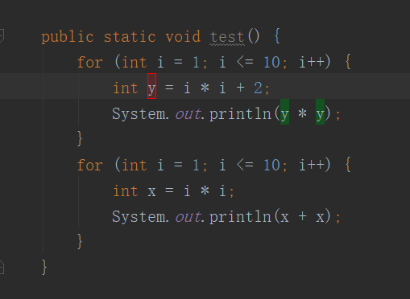

可以看出来，idea的rename功能完全**不会误伤到不同作用域类的同名实体**，可以说是做到了精确打击。

此外，Refactor中还提供了Safe delete等人性化的功能，等待大家去尝试（Safe delete是在删除类、方法、变量时，检测是否依然在其他的地方对该实体存在依赖，以达到安全删除的目的）。

此外，**IDEA中还提供自动的单词拼写检查**，如果出现错误的单词拼写，则会像word一样第一时间显示出来并提示编程者尽快修复，或者将该单词（因为的确可能有存在专有名词等非常规词汇的情况）添加进工程字典内。

##### 代码快速查看

有的时候，代码一旦变得复杂，我们就会需要经常在方法和类之间来回跳跃查找代码。

然而在IDEA中，这一麻烦不复存在，我们可以直接在类名、方法名、变量名上进行`Ctrl`+`鼠标左键`，一键跳跃到想看的类或方法的代码实现位置上。（甚至可以跳到java的底层源代码上，源码党们的福音）

就像在上面的程序的`nextInt`方法上点击`Ctrl`+`鼠标左键`，结果如下：

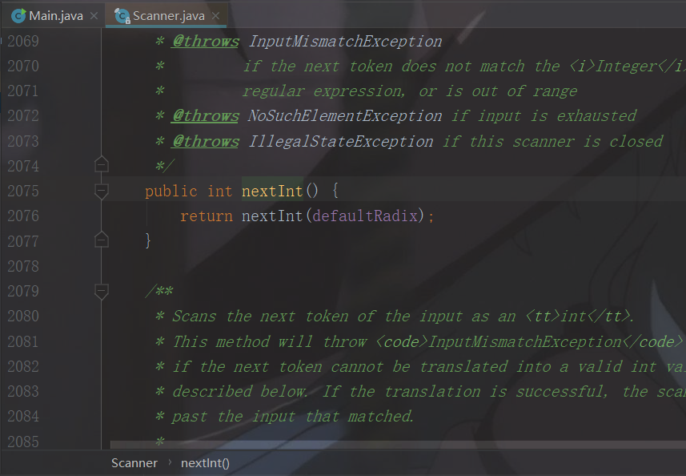

我们成功跳到了Java底层对`Scanner`类`nextInt`方法的源码实现上。

#### 快速寻找我想要的功能

IDEA作为一款真真正正的现代化ide，和其他一些古代编辑器相比，另一大亮点就是可以快速寻找想要的功能。

在菜单栏，点击`Help`-->`Find Action`（快捷键为`Ctrl`+`Shift`+`A`）

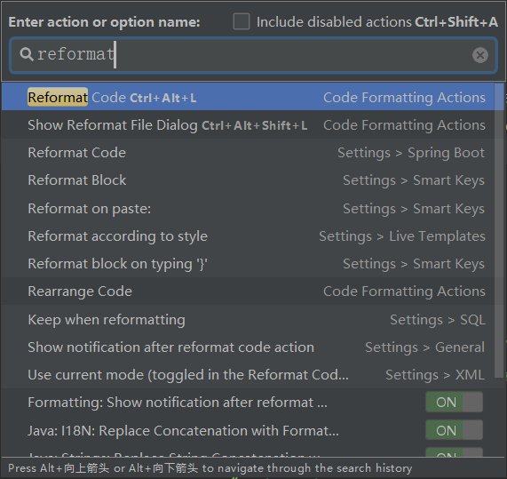

可以在这里直接搜索想要找的功能或者设置。（实际上Jetbrains的Find Action功能提供非常精细的查找，不仅仅支持菜单栏的查找，连内部设置的细节甚至都可以找得到）

#### javadoc

在正规的工程代码规范中，还有一项很重要的要求——写文档。

然而，这个文档也是有很严格的规范的，不是很多人认为的那样，随便注释一点就可以当做文档。而这种**符合java工程规范的文档形式就称之为javadoc**（类似的代码注释规范还有phpdoc等，更多的规则等细节可以自行查阅代码规范手册或者百度，本文中不作过多讲述）

比如，我们再次来到之前写的`test`方法上，打入`/`、`*`、`*`，再按下回车：

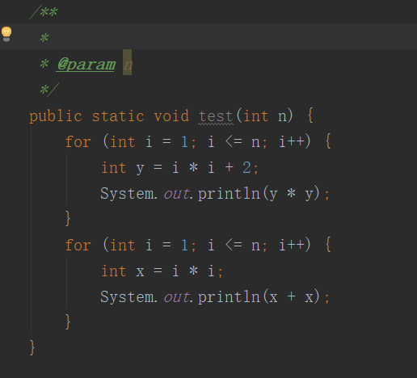

然后我们按照规定的格式来补齐这个javadoc框架：

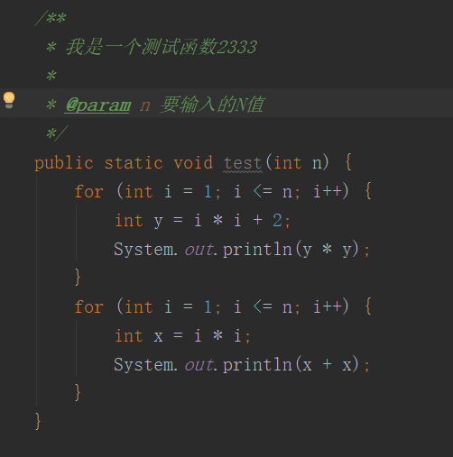

一个格式规范且很清晰的方法文档就这样生成了。

除此之外，javadoc规范另外一个很重要的用途就是可以一键生成html页面版项目文档。点击**Menu -> Tools -> Generate Javadoc**，即可自动生成完整的javadoc网页版文档（[具体操作可参考此教程](https://www.cnblogs.com/xiaoming0601/p/6657136.html)）

#### 插件

实际上，在这个网络化体系化作战的时代，jetbrains也有**很多的在线插件支持**。

我们只需要进入**Menu -> File -> Settings -> Plugins**，再点击`Install Jetbrains plugin...`，即可**搜索插件**并直接进行**在线安装**。（实际上，由于大陆内一些神奇的不可言表的原因，经常会出现连接失败或者下载速度极慢的情况。这时候请自行**设置代理**，本文不再赘述）

接下来笔者来安利几款比较好的插件：

##### MetricsReloaded

对于之后的博客作业，我们需要用到的代码分析插件。

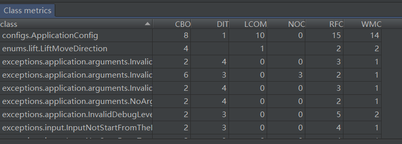

##### Statistic

这个插件没啥别的功能，就是统计代码行数。那意义何在呢？嘿嘿，试想写着代码，看着代码行数不断飚增，是不是一件很带感的事情呢(*^▽^*)。
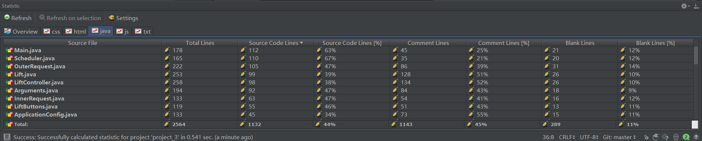

##### .ignore

这是个管理.gitignore的插件，可以用颜色标记出当前项目下所有文件的git状态（包括<b style = "color: gray">Ignored</b>，<b style = "color: red">Untracked</b>，<b style = "color: lightblue">Unmodified</b>，<b style = "color: lightgreen">Modified</b>）

##### Markdown support

对于使用Markdown书写文档的同学来说，能有一款优雅可视的内置插件当然是一件很爽的事情。就像这样
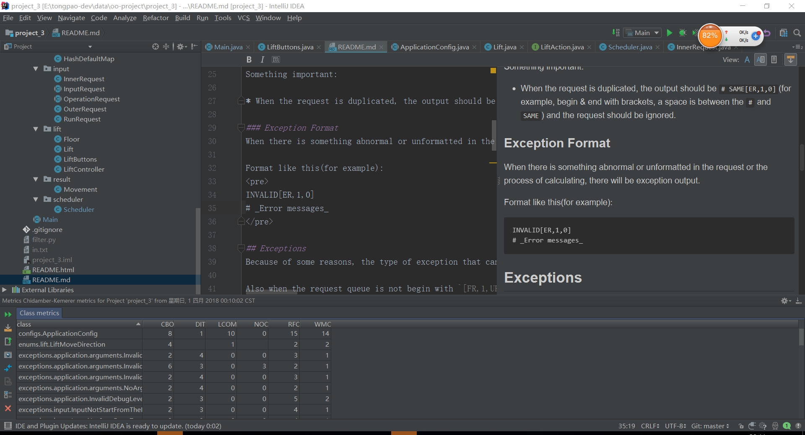

##### Background Image Plus

对于想要给自己的ide设置壁纸的同学们，可以安装这一插件，并进行相关的配置，就像这样。

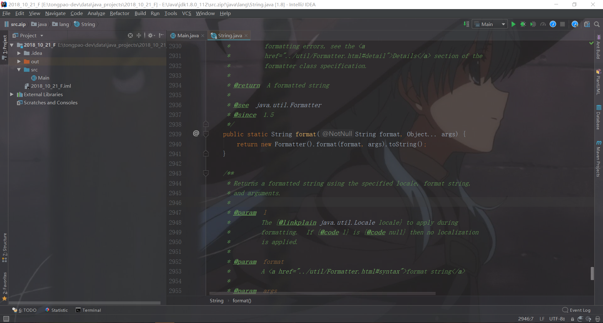

## Markdown教程

Markdown 是一种用来写作的轻量级标记语言，它用简洁的语法代替排版，使普通文本内容具有一定的格式。对比于Word文档一般需要大量的排版、字体设置，Markdown语言可以通过很简单的几行代码就准确控制好文章的格式。在大二下学期的OO课程中，大家写的单元总结以及代码Readme文档都用到这种语言书写文档。本文档也是markdown书写的。

那么，我们要如何利用Markdown语言书写文档？这就需要借助Markdown编辑器了。Typora编辑器是一种即时预览型编辑器，具有高流畅度和快反应速度。因此，我们推荐大家使用Typora编辑器。

### Typora安装

Typora 官网：https://typora.io/

> VSCode中也有typora的插件，同学们可以直接下载使用

### Markdown教程

我们推荐同学们通过菜鸟教程学习Markdown基本语法

链接：https://www.runoob.com/markdown/md-tutorial.html
