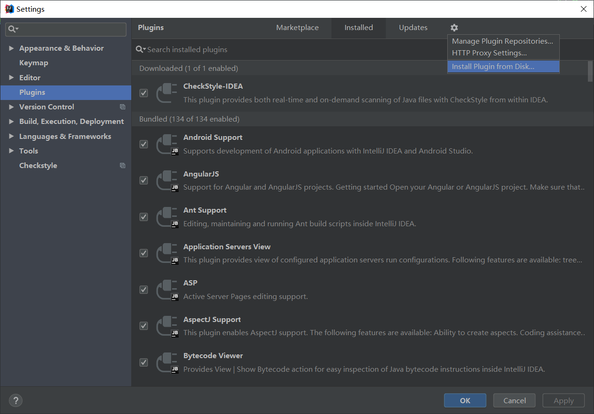
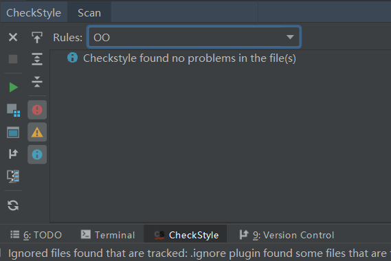
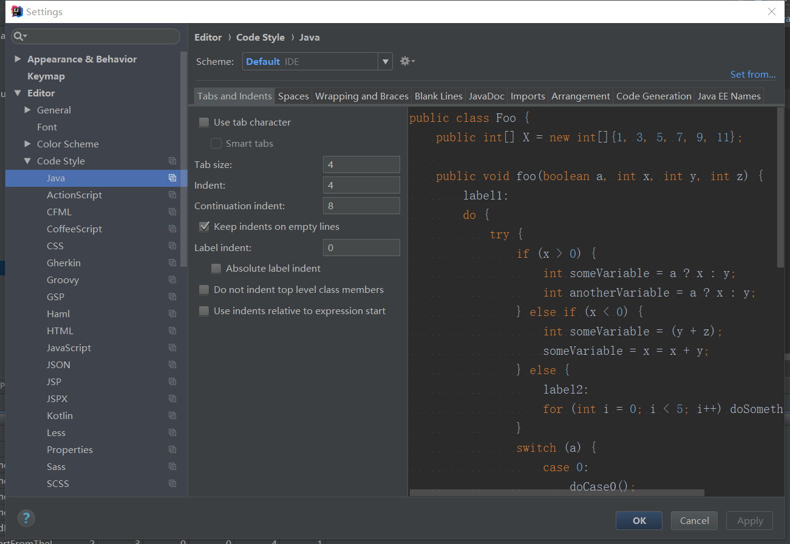
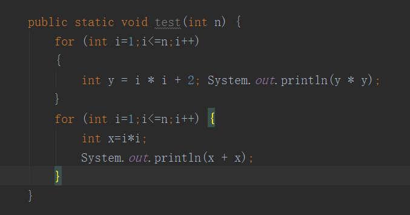
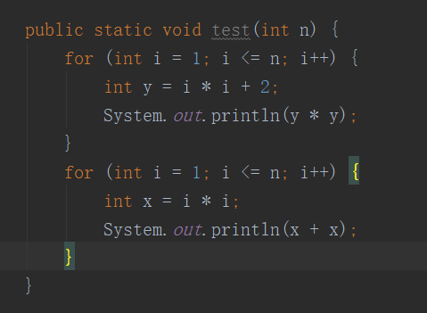

# Checkstyle说明

## 分数计算方式

- 每次作业代码风格部分默认总分为100分，采用扣分制
- 对于设计风格类（即风格文档的第六节）部分
  - 类长度风格问题，**每个扣50分**
  - 可见性检查、方法长度问题，**每个扣20分**
  - 参数个数、循环嵌套、语句嵌套问题，**每个扣10分**
  - 嵌套内联条件、布尔表达式、参数赋值问题，**每个扣5分**
- 对于命名约定类（即风格文档第五章）部分
  - 所有的问题，**每个扣5分**
- 对于除此之外的问题，**每个扣2分**
- **对于所有的问题扣分上不封顶，扣到0分为止**

## IDEA Checkstyle插件配置

### 代码风格配置检查

研读过[阿里巴巴java开发代码规范手册](https://files.cnblogs.com/files/han-1034683568/%E9%98%BF%E9%87%8C%E5%B7%B4%E5%B7%B4Java%E5%BC%80%E5%8F%91%E6%89%8B%E5%86%8Cv1.2.0.pdf)的同学们应该知道，在真正的工程代码中，处于**代码可维护性**和**提高团队合作效率**的考量，会有很多代码规范性的要求。因此在每一次oo作业中，我们都会使用一个叫做`checkstyle`的Java代码风格检查工具进行代码风格的检查。其中配置文件使用本仓库内提供的`config.xml`文件，作为代码风格检查的依据。

如何在本地配置代码风格检查插件，检查java代码是否符合规范？我们通过安装`Checkstyle-IDEA`插件来进行。

### Checkstyle-IDEA 插件

代码风格配置文件支持最新版本的Checkstyle插件，因此我们推荐你直接在`File->Settings->Plugins->Marketplace`直接搜索并下载最新版本`CheckStyle-IDEA`插件。

下载完插件之后，我们依次点击`File->Settings->Plugins`进入插件管理页面，在这个页面中点击`Install Plugin from Disk...`找到我们刚刚下载好的zip包，即可完成配置指定版本的`checkstyle-idea`插件。配置完成后，我们只需要重启IDEA，插件即可生效。



#### 代码风格检查文件

插件安装完成后，依次点击`File->Settings->Tools->Checkstyle`将我们提供的代码风格检查文件`checkstyle_config.xml`载入，随后在窗口左下角点入CheckStyle选取相应的规则（即我们导入的配置文件）即可进行代码风格检查。



在窗口左下角点入CheckStyle选取相应的规则（即我们导入的配置文件）进行代码风格检查。

- 【注意】

  这里有一点MacOS用户需要特别注意，你在配置的时候导入插件和载入代码风格检查文件与Windows略有不同：

  1. 我们使用快捷键`command`+`,`即可打开MacOS下的`Preferences`，类似于Windows下的`Settings`页面，接下来你就可以选择`Plugin`按照Windows下的方式操作了。按照Windows下安装插件完成并重启IDEA后，可以在`Preferences`中选择`CheckStyle`将我们提供的代码风格检查文件`config.xml`载入。
  2. 我们注意到，在MacOS下`Preferences`与`Settings`和`Other Settings`相似，但是，`Preferences`下对`CheckStyle`的改变只能作用于当前Project，所以我们需要找到`File->New Projects Setup->Settings for New Projects->Preferences for New Projects->Tools->CheckStyle`，在这里再重复载入代码风格检查文件，下次建立新的项目就也可以不用重复设置啦。

### IDEA的特性

#### 代码风格

可能不少同学已经写了规模不小的代码，而且从未参照过代码规范。不必担心，jetbrains给我们提供了很方便的代码风格工具：





可以看到，使用`tab`还是空格缩进，以及缩进几格都是可以自由调整的（实际上，**一般企业的代码工程规范是使用4个空格作为缩进**）。此外，在别的标签页下，还有很多可以调整的代码风格相关的东西（**包括你们圣战了无数年的大括号换行不换行问题**）。

而这样的代码习惯调整，只需要**Menu -> File -> Settings -> Editor -> Code Style -> Java**即可找到并调整（可以看到，除了java还有非常多种的语言。没错，一般的jetbrains IDE都支持多种语言的编辑，如果你有同时使用多种语言的需求的话，可以在其他语言对应的区域进行编辑。）

在我们调整好了之后，我们在代码位置按下`Ctrl`+`Alt`+`L`（Pycharm中是`Alt`+`F8`）即可**完成代码规范化**（或者**Menu -> Code -> Reformat Code**），效果如下：





只需要按下`Ctrl`+`Alt`+`L`，代码立刻就变成了这样：





代码瞬间变得干净整洁，清清爽爽。

## 常见问题

### Q：作业中会如何检查代码风格？

A：我们会使用一个叫做 `checkstyle` 的 Java 代码风格检查工具进行代码风格的检查。其中配置文件使用本仓库内提供的 `config.xml` 文件 （见[`checkstyle_config.xml`](./checkstyle_config.xml)），作为代码风格检查的依据。

值得注意的是，我们的检查对象为你的代码仓库内全部的 `.java` 文件，其他的文件会被系统自动忽略。

### Q：我们本地是否可以检查代码风格？

A：当然可以。你们有以下几种方法检测自己的代码风格：

* 从Checkstyle 官网上下载 checkstyle 的 jar 文件，并在本机按照help里提供的命令行参数进行代码风格的检查。
* 对于ubuntu（应该其他 unix 系统也行，但是只在 ubuntu 上试过）用户，可以使用我们封装的 `pycheckstyle` Python 包进行快速代码风格检测（目前仅支持Python3）

* ***【推荐】*** **对于 IDEA 用户，可以下载安装`Checkstyle-IDEA`插件（见[http://gitlab.oo.buaa.edu.cn/2024_oopre_public/course_system_guidebook/checkstyle_config.xml](http://gitlab.oo.buaa.edu.cn/2024_oopre_public/course_system_guidebook/-/blob/main/checkstyle_config.xml))），对 idea 内的代码进行实时风格检测。只需要安装好插件后在设置中将我们提供的 `checkstyle_config.xml` 载入即可。**（更详细的攻略可以自行百度）
* 对于 Eclipse 用户，实际上也存在 checkstyle 支持，可以自行百度探索。

### Q：代码风格文档内是否会和配置文件等存在冲突？如果存在，如何处理？

A：我们的文档主要是将官方文档中相关的部分进行一些较为通俗的解释，可能有些细节上确实不够，也有可能存在少量的偏差。对于这样的情况，我们以 checkstyle 的官方文档，以及 `checkstyle` 在使用 `checkstyle_config.xml` 时的实际检查结果为准。

### Q：我们如何去查看官方文档的对应规则？

A：在我们提供的风格文档中，均将配置文件中的对应部分写了出来。可以根据 `module` 的 `name` 字段信息，在官方文档上查找对应的规则以及说明。

## 一些有用的资料

* [Checkstyle官方文档（全英文版）](http://checkstyle.sourceforge.net/checks.html)
* [Google官方代码规范（我们所使用的代码规范的原型）](https://google.github.io/styleguide/javaguide.html)
* [Sun官方代码规范](http://java.sun.com/docs/books/jls/second_edition/html/index.html)
* [【推荐】IDEA Checkstyle插件主页](http://plugins.jetbrains.com/plugin/1065-checkstyle-idea)
* [【课程组提供】pycheckstyle封装包](https://github.com/OO-guide-2019/pycheckstyle)

# 附：java codestyle guide(simplified version)

>注：下面内容为Checkstyle原理，感兴趣的同学自行阅读，非课程要求

## 1 术语说明

P.S.：本指南中带有“（建议）”标志的部分是作者对于某个问题的建议，不一定严格按照给出示例，只是建议的方式，满足要求的方式都可以。

P.P.S.：在每条代码风格规则中我们会标注 `config.xml` 文件中对应的部分，一般紧跟着某个小标题之后。

### 1.1 块状结构

块状结构 (block-like construct) 指的是一个类，方法或构造函数的主体。

### 1.2 自动换行

一般情况下，一行长代码为了避免超出单行字符限制 (100 个字符) 而被分为多行，我们称之为自动换行 (line-wrapping)。

------

## 2 源文件基础

### 2.1 文件名

```xml
<module name="OuterTypeFilename"/>
```

源文件使用其最顶层的类名来命名(一般一个文件只包含一个类)，大小写敏感，文件扩展名为 `.java`。

### 2.2 文件编码格式

```xml
<property name="charset" value="UTF-8"/>
```

源文件编码格式为 UTF-8。

### 2.3 特殊字符

#### 2.3.1 ASCII字符

所有源代码中一律使用 ASCII 字符，如无特殊注明，使用的非ASCII字符无效（即尽量不要使用中文注释，学着开始使用英文注释)。

#### 2.3.2 空白字符

```xml
<module name="FileTabCharacter">
	<property name="eachLine" value="true"/>
</module>
```

除了行结束符序列（换行），ASCII水平空格字符(0x20，即空格)是源代码中唯一允许出现的空白字符，这意味着

- 制表符'\t'不用于缩进（源代码不能出现任何一个'\t'）。
- 所有其他字符串中的空白字符都要进行转义。

注：一般的缩进单位采取**4个空格**。

------

## 3 源文件结构

一个源文件结构应该如下

1. `package` 语句。
2. `import` 语句。
3. 一个顶级类。

### 3.1 package语句

```xml
<module name="NoLineWrap"/>
```

该语句独立一行。

### 3.2 import语句

#### 3.2.1 import不要通配符

```xml
<module name="AvoidStarImport"/>
```

import中应该准确指明需要引入的模块，不要使用通配符（例如：`import java.util.*;`）。

#### 3.2.2 单独成行

```xml
<module name="NoLineWrap"/>
```

每个import语句单独成行。

#### 3.2.3 无用的import

```xml
<module name="UnusedImports"/>
```

禁止出现没有使用的 `import`。

### 3.3 类声明

#### 3.3.1 只有一个顶级类

```xml
<module name="OneTopLevelClass"/>
```

每个源文件中顶级类声明有且只有一个，在一个与其同名的源文件中（即类 `ObjectOriented` 一定在 `ObjectOriented.java` 文件中）

#### 3.3.2 类函数/方法顺序

```xml
<module name="OverloadMethodsDeclarationOrder"/>
```

关于类中方法的顺序，建议选择**除时间顺序外一种有逻辑的顺序**。但要求**重载的方法必须不能分离**，即当一个类有多个构造函数，或者多个重载了的同名方法，这些函数/方法应该出现在一起，中间不许有其他函数/方法。

------

## 4 格式

### 4.1 大括号

#### 4.1.1 必须使用大括号

```xml
<module name="NeedBraces"/>
```

大括号`{}`和`if, else, for, do, while，case，default`等语句一起使用，即使其中只有一条语句或是空语句，也必须写上大括号。

#### 4.1.2 空块使用简洁写法

```xml
<module name="EmptyBlock">
	<property name="option" value="TEXT"/>
	<property name="tokens"
	 value="LITERAL_TRY, LITERAL_FINALLY, LITERAL_IF, LITERAL_ELSE, LITERAL_SWITCH"/>
</module>
```

一个空的块状结构中没有语句，所以大括号要写成 `{}`，不需要换行。但如果他是一个多块语句的一部分(`if` / `else` 或 `try` / `catch` / `finally`) ，即使大括号内没内容，右大括号也要换行。

```java
void emptyBlock() {}

if (x == 1) {
    
} else if (x == 2) {
    
} else {
    
}
```

### 4.2 缩进

```xml
<module name="Indentation">
    <property name="basicOffset" value="4"/>
    <property name="braceAdjustment" value="0"/>
    <property name="caseIndent" value="4"/>
    <property name="throwsIndent" value="4"/>
    <property name="lineWrappingIndentation" value="4"/>
    <property name="arrayInitIndent" value="4"/>
</module>
```

每当开始一个新的块，缩进增加**4个空格**，当块结束时，缩进返回先前的缩进级别。该缩进级别适用于代码和注释。

```java
for (int i = 0; i < 10; ++i) {
  	// when condition satisfied
  	if (i > 5) {
    	try {
      		// func for deal with correct state
       		something();   
    	} catch (Exception e) {
      		recover();
    	}
  	}
}
```

### 4.3 一行一个语句

```xml
<module name="OneStatementPerLine"/>
```

每个语句之后必须换行。

### 4.4 单行字符个数限制

```xml
<module name="LineLength">
	<property name="max" value="80"/>
	<property name="ignorePattern" value="^package.*|^import.*|
                                          a href|href|http://|https://|ftp://"/>
</module>
```

源代码中除了下述例外情况，单行必须满足**80**个字符的限制。如果某一行超过这个限制，必须自动换行。

例外：

- 不可能满足列限制的行（如长 URL）。
- `packge` 和 `import` 语句。
- 注释中那些需要被复制粘贴到shell中使用的命令。

### 4.5 自动换行准则（建议）

对于超出限制的行进行自动换行的方法有很多，在这里作者给出一些建议性的准则：

1. **合理**缩短命名长度（如 `image` 用 `img` 代替）。

2. 在语句中提取方法或局部变量，从而使该行代码变短。

3. 断开原则，此处的准则是更倾向于在更高的语法级别处断开。

   - 如果在**非赋值运算符**处断开，那么在该符号前断开。

     ```java
     variableNaive = (factorC + factorCpp + factorPython
                       + factorRuby + factorJava) / 2
     ```

   - 如果在**赋值运算符**处断开，那么在该符号后断开。

     ```java
     handleNaive.arrayUint32Complicated[i * 10 + j] = 
         (meanFirst + meanSecond + meanThird + meanFourth)
     ```

   - 方法名或构造函数名与左括号留在同一行。

   - 逗号`,`和其前面的内容留在同一行。

4. 自动换行时，第一行后面的行**至少**比第一行多缩进**4个空格** 。

### 4.6 空白

#### 4.6.1 垂直空白（空行）

```xml
<module name="EmptyLineSeparator">
	<property name="allowNoEmptyLineBetweenFields" value="true"/>
	<property name="allowMultipleEmptyLines" value="false"/>
</module>
```

以下情况需要使用**一个空行**：

1. 类内连续的成员之间：字段，构造函数，方法，嵌套类，静态初始化块，实例初始化块。
   - **例外**：两个连续字段之间的空行是可选的，用于字段的空行主要用来对字段进行逻辑分组。
2. 在函数体内，语句的逻辑分组间使用空行。
3. 要满足本文档中其他节的空行要求。
4. 不允许连续多个空行。

#### 4.6.2 水平空白

```xml
<module name="GenericWhitespace">
    <message key="ws.followed"
    value="GenericWhitespace ''{0}'' is followed by whitespace."/>
    <message key="ws.preceded"
    value="GenericWhitespace ''{0}'' is preceded with whitespace."/>
    <message key="ws.illegalFollow"
    value="GenericWhitespace ''{0}'' should followed by whitespace."/>
    <message key="ws.notPreceded"
    value="GenericWhitespace ''{0}'' is not preceded with whitespace."/>
</module>

<module name="MethodParamPad"/>

<module name="ParenPad"/>

<module name="NoWhitespaceBefore">
    <property name="tokens"
              value="COMMA, SEMI, POST_INC, POST_DEC, DOT, ELLIPSIS, METHOD_REF"/>
    <property name="allowLineBreaks" value="true"/>
</module>
```

除了语言需求和其它规则，并且除了文字，注释和 Javadoc 用到单个空格，单个 ASCII 空格也出现在以下几个地方：

1. 分隔任何保留字与紧随其后的左括号`(`(如`if, for catch`等)。
2. 分隔任何保留字与其前面的右大括号`}`(如`else, catch`)。
3. 在任何左大括号`{`前，但有两种例外：
   - `@SomeAnnotation({a, b}) 包含关系的大括号不用空格。
   - `String[][] x = foo; ` 两个大括号间不用空格。
4. 在任何二元或三元运算符的两侧。这也适用于以下“类运算符”符号：
   - 类型界限中的&(`<T extends Foo & Bar>`)。
   - catch块中的管道符号(`catch (FooException | BarException e`)。
   - `foreach`语句中的分号。
5. 在 `, : ;` 及右括号(`)`) 后。
6. 如果在一条语句后做注释，则双斜杠 (//) 两边都要空格。
7. 类型和变量之间：List list。

### 4.7 用小括号来限定组，即显式地限定运算顺序（建议）

我们没有理由假设 reviewer 能够记住整个 java 运算符优先级表，所以要**适当地使用小括号**来显式的标出运算顺序。

### 4.8 具体结构

#### 4.8.1 变量声明

```xml
<module name="MultipleVariableDeclarations"/>
<module name="VariableDeclarationUsageDistance"/>
 <module name="ArrayTypeStyle"/>
```

- 每次只声明一个变量，不要使用组合声明。

  ```java
  int a; // correct
  int a, b; // wrong
  ```

- 需要时才声明，并尽快进行初始化。

  不要在代码块的开头一次性声明所有要用到的局部变量，而是在第一次需要使用它时才声明，并且在声明之后尽快进行初始化。

- 数组声明风格

  要把中括号看作类型的一部分，即

  ```java
  String[] args; // correct
  String args[]; // wrong
  ```

#### 4.8.2 switch语句

```xml
<module name="MissingSwitchDefault"/>
<module name="FallThrough"/>
```

- 每个switch必须都要包含一个`default`语句组，即使里面什么代码也没有（对枚举类型使用switch时除外）。

- 在一个swtich块内，每个语句组要么通过`break, return`或抛出异常来终止，要么通过注释`// fall through`来表示继续执行到下一个语句组，这个注释不需要在`default`语句组中出现

  ```java
  switch (variable) {
      case 1:
      	  func1();
      	  // fall through
      case 2:
      	  func2();
      	  break;
      default:
  }
  ```

#### 4.8.3 注解(Annotations)

```xml
<module name="AnnotationLocation">
    <property name="id" value="AnnotationLocationMostCases"/>
    <property name="tokens"
              value="CLASS_DEF, INTERFACE_DEF, ENUM_DEF, METHOD_DEF, CTOR_DEF"/>
</module>
```

注解紧跟在文档部分后面，一个注解独占一行，后续的缩进等级不变。

```java
@Override
public int naiveMethod() {
    // something
}
```

### 4.9 Modifiers

```xml
<module name="ModifierOrder"/>
```

类或成员的Modifiers如果存在，则需要按照如下规范顺序出现：

```java
public protected private abstract static final transient volatile synchronized native strictfp
```

### 4.10 注释

```xml
<module name="CommentsIndentation"/>
```

块注释与其周围的代码在同一缩进级别。它们可以是 `/* ... */` 风格，也可以是 `// ...` 风格。对于多行的 `/* ... */` 注释，后续行必须从 `*` 开始， 并且与前一行的 `*` 对齐。以下三种示例注释都是 OK 的。

```java
/*
 * This is 
 * okay.            
 */

// And so
// is this

/* Or you can
 * even do this. */
```

### 4.11 long型变量规范

```xml
<module name="UpperEll"/>
```

long 型整型变量的后缀必须使用 `L` 左右后缀，例如：

```java
10000000000000L
```

------

## 5 命名约定

### 5.1 标识符通用规则

标识符只能使用 ASCII 字母和数字，即标识符必须匹配正则表达式 `\w+` 。

### 5.2 标识符类型规则

#### 5.2.1 包名

```xml
<module name="PackageName">
```

包名全部小写，连续的单词只是简单地连接起来，不使用下划线。

#### 5.2.2 类名

```xml
<module name="TypeName">
    <message key="name.invalidPattern"
             value="Type name ''{0}'' must match pattern ''{1}''."/>
</module>
```

类名使用大驼峰式命名法。

测试类的命名以他要测试的类的名称开始，以 `Test` 结束，例如 `Elevator `对应 `ElevatorTest` 。

接口的命名以具体命名内容开始，以 `Interface` 结束，例如 `ApplicationInterface` 。

#### 5.2.3 方法名

```xml
<module name="MemberName">
    <property name="format" value="^[a-z][a-z0-9][a-zA-Z0-9]*$"/>
    <message key="name.invalidPattern"
             value="Member name ''{0}'' must match pattern ''{1}''."/>
</module>
```

方法名使用小驼峰式命名法。

方法名通常是动词或者动词短语。

#### 5.2.4 常量名（建议）

常量命名模式为 `CONSTANT_NAME`，即全部字母大写，然后用下划线分割单词。

常量名通常是名词或者名词短语。

#### 5.2.5 变量名（包括参数名）

```xml
<module name="MemberName">
    <property name="format" value="^[a-z][a-z0-9][a-zA-Z0-9]*$"/>
    <message key="name.invalidPattern"
             value="Member name ''{0}'' must match pattern ''{1}''."/>
</module>
<module name="ParameterName">
    <property name="format" value="^[a-z]([a-z0-9][a-zA-Z0-9]*)?$"/>
    <message key="name.invalidPattern"
             value="Parameter name ''{0}'' must match pattern ''{1}''."/>
</module>
<module name="CatchParameterName">
    <property name="format" value="^[a-z]([a-z0-9][a-zA-Z0-9]*)?$"/>
    <message key="name.invalidPattern"
             value="Catch parameter name ''{0}'' must match pattern ''{1}''."/>
</module>
<module name="LocalVariableName">
    <property name="tokens" value="VARIABLE_DEF"/>
    <property name="format" value="^[a-z]([a-z0-9][a-zA-Z0-9]*)?$"/>
    <message key="name.invalidPattern"
             value="Local variable name ''{0}'' must match pattern ''{1}''."/>
</module>
```

变量名使用小驼峰式命名法。

除了临时变量和循环变量，避免使用单字符进行命名。

#### 5.2.6 类型变量名

```xml
<module name="ClassTypeParameterName">
    <property name="format" value="(^[A-Z][0-9]?)$)"/>
    <message key="name.invalidPattern"
             value="Class type name ''{0}'' must match pattern ''{1}''."/>
</module>
<module name="MethodTypeParameterName">
    <property name="format" value="(^[A-Z][0-9]?)$)"/>
    <message key="name.invalidPattern"
             value="Method type name ''{0}'' must match pattern ''{1}''."/>
</module>
<module name="InterfaceTypeParameterName">
    <property name="format" value="(^[A-Z][0-9]?)$)"/>
    <message key="name.invalidPattern"
             value="Interface type name ''{0}'' must match pattern ''{1}''."/>
</module>
```

类型变量使用单个的大写字母命名（如 T, E, V），例如：

```java
MyArrayList<T>
```

### 5.3 驼峰式命名法

```xml
<module name="AbbreviationAsWordInName">
    <property name="ignoreFinal" value="false"/>
    <property name="allowedAbbreviationLength" value="1"/>
</module>
```

驼峰式命名法分为大驼峰式命名法 `UpperCamelCase` 和小驼峰式命名法 `lowerCamelCase`。有时命名会遇到缩略语或不寻常的结构(例如 ”IPv6” 或 ”iOS”)。有以下的转换方案。

名字从`散文形式`(prose form)开始:

1. 把短语转换为纯 ASCII 码，并且移除任何单引号。例如：”Müller’s algorithm” 将变成 ”Muellers algorithm”。
2. 把这个结果切分成单词，在空格或其它标点符号(通常是连字符)处分割开。
   - 推荐：如果某个单词已经有了常用的驼峰表示形式，按它的组成将它分割开(如 ”AdWords” 将分割成 ”ad words”)。 需要注意的是”iOS”并不是一个真正的驼峰表示形式，因此该推荐对它并不适用。
3. 现在将所有字母都小写(包括缩写)，然后将单词的第一个字母大写：
   - 每个单词的第一个字母都大写，来得到大驼峰式命名。
   - 除了第一个单词，每个单词的第一个字母都大写，来得到小驼峰式命名。
4. 最后将所有的单词连接起来得到一个标识符。

示例：

```java
Prose form                Correct               Incorrect
------------------------------------------------------------------
"XML HTTP request"        XmlHttpRequest        XMLHTTPRequest
"new customer ID"         newCustomerId         newCustomerID
"inner stopwatch"         innerStopwatch        innerStopWatch
"supports IPv6 on iOS?"   supportsIpv6OnIos     supportsIPv6OnIOS
"YouTube importer"        YouTubeImporter
```

------

## 6 设计规范

### 6.1 类长度

```xml
<module name="FileLength">
  <property name="max" value="500"/>
</module>
```

一个顶级类（即一个文件）最多有 500 行。

### 6.2 方法长度

```xml
<module name="MethodLength">
  <property name="tokens" value="METHOD_DEF"/>
  <property name="max" value="60"/>
  <property name="countEmpty" value="false"/>
</module>
```

一个方法总长度不得超过 60 行（不包括其中的空行）。

### 6.3 参数个数

```xml
<module name="ParameterNumber">
  <property name="max" value="8"/>
  <property name="tokens" value="METHOD_DEF"/>
</module>
```

一个方法或者构造函数的参数数目不得超过 8 个。

### 6.4 类成员变量的可见性检查

```xml
<module name="VisibilityModifier"/>
```

严格检查类成员变量的可见性。只有被 `static final` 修饰的不可变对象，或是被可以是特殊注解修饰的对象才可以为 `public`，其他一律为 `private`。

### 6.5 布尔表达式复杂度

```xml
<module name="BooleanExpressionComplexity">
  <property name="max" value="6"/>
</module>
```

禁止使用过于复杂的布尔表达式，会造成 reviewer 者阅读困难和更高的 debug 难度，最大的布尔表达式中运算符个数是 6。

### 6.6 禁止嵌套内联条件语句（inline conditions)

```xml
<module name="AvoidInlineConditionals"/>
```

例如：

```java
String a = "oo";
String b = (a==null || a.length<1) ? null : a.substring(1);
```

简单来说，对于三目运算符，禁止任何嵌套。如果有类似的逻辑写成显示的 `if-else` 语句。

### 6.7 禁止对参数的赋值

```xml
<module name="ParameterAssignment"/>
```

禁止对方法中参数的赋值操作。

### 6.8 循环嵌套重数限制

```xml
<module name="NestedForDepth">
  <property name="max" value="4"/>
</module>
```

对于各类循环语句，限制最大嵌套重数为 4。

### 6.9 条件语句嵌套重数限制

```xml
<module name="NestedIfDepth">
  <property name="max" value="4"/>
</module>
```

对于if-else语句，限制最大嵌套重数为 4。

------

## 7 编程实践

### 7.1 @Override的使用

只要合理，就尽可能地使用 `@Override` 注解，表明是重写

### 7.2 对于类的静态成员和方法，使用类名进行调用

对于类的静态成员和方法，使用类名进行调用，而不是使用对象名或表达式

```java
NaiveClass handle_simple = new NaiveClass();
NaiveClass.staticMethod(); // corrrect
handle_simple.staticMethod(); // wrong
returnNaiveClassObjectMethod().staticMethod(); // wrong
```

### 7.3 对于捕获的异常不能忽视

```xml
<module name="EmptyCatchBlock">
    <property name="exceptionVariableName" value="expected"/>
</module>
```

对于捕获到的异常，不能 ignore，必须进行相应处理，即不允许出现空的 `catch` 块，常见的做法有打印日志，或者是再抛出一个 `AssertionError` 。

------

本指南是基于主流java代码风格指南的简化版，我们基于实际需要进行了一些修改，如有任何建议和问题请联系作者。

email: **niuyazhe@buaa.edu.cn、hansbug@questionor.cn**

github repo: https://github.com/Ailsa99/guide_book_public