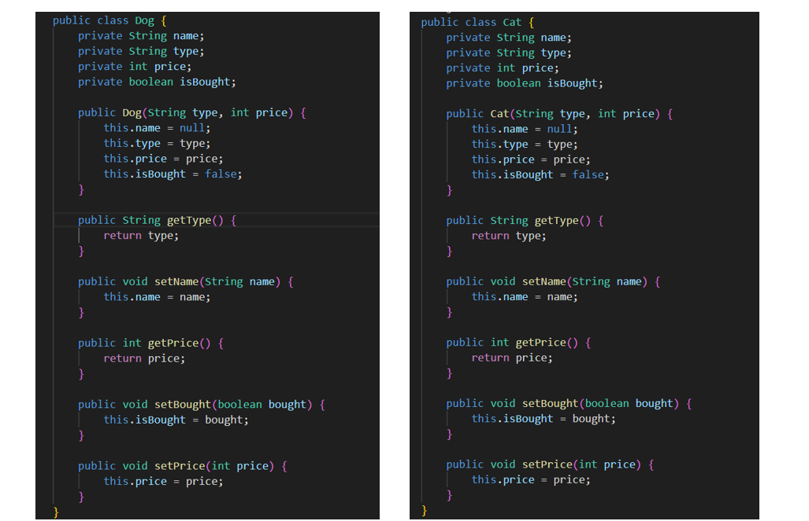
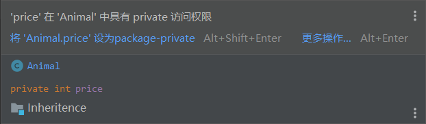

# 第三次作业指导书

## 第零部分：提交要求 && Junit要求

请保证提交项目的顶层目录存在两个文件夹：`src`和`test`（命名需严格与此保持一致），请将作业的**功能代码**存放于`src`文件夹下，同时将相关**junit测试类代码**文件存放于`test`文件夹下，以保证评测的正常进行（评测时**只会**针对`src`目录下的文件进行程序**功能**的评测以及代码风格检测，也就是说，`test`目录下的junit测试代码风格不会被检测）。参考目录结构如下：

```plaintext
|-src
  |- Bottle.java
  |- Equipment.java
  |- ...
|-test
  |- BottleTest.java
  |- EquipmentTest.java
  |- ...
```

本次作业，要求Junit测试覆盖率**保证**`method >= 90％`，`line >= 60%`。（`idea`显示的覆盖率和`评测`测到的覆盖率可能略有差别，请同学们以评测为准）

## 第一部分：训练目标

+   掌握继承以及接口的使用

## 第二部分：预备知识

面向对象编程有三大特征，**封装性**、**继承性**、**多态性**。

### 继承

想要了解继承，我们还是把目光放回我们的宠物商店…… 宠物商店之前只卖狗，但现在它还卖猫了



通过观察，我们发现猫和狗的代码长得几乎一样。他们的属性都包括名字 name，种类 type，价格 price，是否被购买 isBought。同时他们的行为（方法）是高度相近的。如果不对这种情况做修改，就会产生大量重复的不必要的代码。此时正确的做法是：共性提取！

#### 继承的概念

**继承** 就是子类继承父类的特征和行为，使得子类具有父类的属性和方法。子类的创建可以增加新数据、新功能，可以继承父类全部的功能，但是不能选择性的继承父类的部分功能。通过继承，可以起到代码复用的目的。

#### 继承的格式

我们根据Cat和Dog的特性，抽象出一个 **Animal** 类：

```java
public class Animal {
    private String name;
    private String type;
    private int price;
    private boolean isBought;

    public Animal(String type, int price) {
        this.name = null;
        this.type = type;
        this.price = price;
        this.isBought = false;
    }

    public int getPrice() {
        return price;
    }

    public String getType() {
        return type;
    }
}
```

此时 Animal 类即父类，Cat 和 Dog 作为子类继承了父类 基本格式如下：

```java
public class Child extends Parent {
    /* ... */
}
```

对应到我们的例子中即：

```java
public class Dog extends Animal{

    public Dog(String type, int price) {
        super(type, price);
    }

    /* ... */
}
```

```java
public class Cat extends Animal{

    public Cat(String type, int price) {
        super(type, price);
    }

    /* ... */
}
```

> *super*关键字的使用：super可以理解为 **父类的**，就像this可以理解为**当前类**的(也就是继承关系中的子类)，super可以用来调用属性、方法、构造器。对于构造器，即使不显式的写出super，java编译器也会自动在方法初始添加，即在使用子类的构造方法前一定先调用父类的构造方法。

#### 继承中的属性的访问

此时如果我们想要同时给小狗和小猫加上 **年龄** 的属性，不需要在 Dog 和 Cat 类分别添加`private int age;` 只需要在二者共同的父类 **Animal** 中做相应属性的增加

```java
public class Animal {
    private String name;
    private String type;
    private int price;
    private boolean isBought;
    private int age; /* new added */

    public Animal(String type, int price) {
        this.name = null;
        this.type = type;
        this.price = price;
        this.isBought = false;
        this.age = 0; /* new added */
    }

    public int getPrice() {
        return price;
    }

    public void information() {
        System.out.println("pet's price is: " + this.price);
    }
}
```

但我们观察这样一段代码，当我想要在 Dog 类输出它的价格……

```java
public class Dog extends Animal{

    public Dog(String type, int price, int age) {
        super(type, price, age);
    }

    public void printPrice() {
        System.out.println("dog's price is: " + this.price); // error!
    }
}
```



我们出现了编译错误！ 这是因为子类无法访问父类被 **private** 修饰的字段或方法，除非使用 **protected** 修饰

```java
public class Dog extends Animal{

    public Dog(String type, int price, int age) {
        super(type, price, age);
    }

    public void information() {
        System.out.println("dog's price is: " + super.getPrice()); 
    }
}
```

#### 继承中的方法调用

当父子类出现同名方法时，我们观察创建的对象类型，是哪类就优先调用哪类的方法，若本类中不存在该方法，那么则向上寻找父类方法进行调用。

```java
public class Main {
    public static void main(String[] args) {
        Dog bernese = new Dog("Bernese Mountain", 18000);
        Animal animal = new Animal("unknown species", 0);
        Animal strayDog = new Dog("unknown dog type", 3);
        // Dog sth = new Animal("***", 0); 错误！！！！
        bernese.information(); // new Dog -> Dog类中有该方法 -> 调用Dog类方法
        System.out.println("-----------------------------------");
        animal.information(); // new Animal -> Animal类中有该方法 -> 调用Animal类方法
        System.out.println("-----------------------------------");
        strayDog.information();// new Dog -> Dog类中有该方法 -> 调用Dog类方法
    }
}
```

```
dog's price is: 18000
-----------------------------------
pet's price is: 0
-----------------------------------
dog's price is: 3
```

#### 继承中的方法重写

不难理解，如果子类有自己**独特**的方法/属性，那么直接加入到子类中即可。但当我在子类中需要对父类的方法进行迭代更新，是否要将父类的方法重新全部重写一遍呢？ 显然不是的，我们之所以引入继承就是希望通过重复利用类之间的共性关系来降低代码的冗杂程度。因此我们就引入一个新的概念 **方法重写：override** 在我们的例子中，Animal中有一个方法叫做 *information* ，这个方法只打印了宠物的价格，但我希望当我调用小狗的 information 时，我还可以看到这只小狗的品类。

```java
public class Dog extends Animal{

    public Dog(String type, int price) {
        super(type, price);
    }

    @Override
    public void information() {
        System.out.println("Dog's information: ");
        System.out.println("===================");
        super.information();
        System.out.println("dog's type is: " + this.getType());
    }
}
```

```java
public class Main {
    public static void main(String[] args) {
        Dog bernese = new Dog("Bernese Mountain", 18000);
        bernese.information();
    }
}
```

```
Dog's information: 
===================
pet's price is: 18000
dog's type is: Bernese Mountain
```

#### 继承中的转型

##### 向上转型

在建立了继承关系之后，可以使用**父类型**去引用通过**子类型**创建的对象。这里涉及两个重要的概念，对象与对象引用。一般而言，对象是一个类的实例化结果，对应内存中的一个数据结构。对象引用则是使用一个变量来指向内存中的这个数据结构（即对象）。

如我们可以使用上面的 Dog 类来构造一个对象：`new Dog()` ，这条语句返回一个创建的对象。我们同时需要声明一个对象引用来指向返回的对象，否则可能就找不到这个对象了。所以，一般代码都会这么写：`Dog bernese = new Dog()` 。

在建立了继承关系之后，我们也可以使用 Animal 类来声明一个对象引用，并指向类型为 Dog 的对象：`Animal pet = new Dog(...)`。从程序类型的角度，这个表达方式称为向上的类型转换，简称**向上转型** (up cast)。

相关例子在继承中的方法调用给出，同学们可以仿照案例课下再做尝试

##### 向下转型

Java 语言提供了一个特殊的关键词 `instanceof` 用来判断一个对象引用所指向的对象的创建类型是否为特定的某个类，一般写为 `obj instanceof A`，其中 obj 为一个对象引用，A 为一个类型（类或接口），这个表达式的取值结果为布尔型，如果 obj 的创建类型为 A，则结果为 true，否则为 false。在这个表达式取值为 true 的情况下，可以使用**向下转型** (down cast) 来使用一个 A 类型的对象来引用obj： `A ao = (A)obj` 。注意，实际上 obj 所指向对象的创建类型永远不会发生变化，转型的只是对象引用类型。下面例子给出了相应的向下转型场景：

```java
import java.util.Random;

public class Main {
    public static void main(String[] args) {
        Animal pet;
        if (new Random().nextInt() > 0) { // 随机一个整数
            // 若大于零 则生成一只伯恩山小狗
            pet = new Dog("Bernese Mountain", 18000);
        } else {
            // 若小于零 则声称一只缅因猫
            pet = new Cat("Maine Coon", 8000);
        }

        /* 值得注意的是，
         * 在 `instanceof` 返回真的时候使用向下转型，才能保证向下转型的安全性，否则运行时会触发错误*/    

        if (pet instanceof Dog) {
            System.out.println("this is a dog!");
            Dog bernese = (Dog) pet;
            bernese.information();
        } else if (pet instanceof Cat) {
            System.out.println("this is a cat!");
            Cat maine = (Cat) pet;
            maine.information();
        } else {
            System.out.println("this is an unknown species");
        }
    }
}
```

### 接口

如果说继承是一种类和类之间的共性抽取，那么接口可以认为是行为的规范标准。相较于继承是对类迭代属性，接口更多的是覆写方法。 我们仍然看回宠物商店，宠物店在管理宠物的过程中衍生了三个部门，一个是洗澡部，一个是干饭部，一个是购买处。

我们观察这三个部门

```java
public class Bath {
    public void sendIn(String origin) {
        System.out.println("A pet is sent from " + origin);
    }

    public void sendOut(String target) {
        System.out.println("Bathing department sends a pet to " + target);
    }

    public void operation(Animal animal) {
        System.out.println("Bathing starts");
        animal.enhanceHealthCondition(30);
        System.out.println("Bathing finishes");
    }
}
```

```java
public class Feed {
    public void sendIn(String origin) {
        System.out.println("A pet is sent from " + origin);

    }

    public void sendOut(String target) {
        System.out.println("Feeding department sends a pet to " + target);
    }

    public void operation(Animal animal) {
        System.out.println("Feeding starts");
        animal.enhanceHealthCondition(10);
        System.out.println("Feeding finishes");
    }
}
```

```java
public class Purchase {
    public void sendIn(String origin) {
        System.out.println("A pet is sent from " + origin);

    }

    public void sendOut(String target) {
        System.out.println("Purchasing department sends a pet to " + target);
    }

    public void operation(Animal animal) {
        System.out.println("Negotiating price....");
        if (animal instanceof Dog) {
            System.out.println("A dog sells for " + animal.getPrice() + "￥");
        } else if (animal instanceof Cat) {
            System.out.println("A cat sells for " + animal.getPrice() + "￥");
        }
    }
}
```

发现这三个工作部门的工作模式非常相近，都有统一的三个行为：接受宠物，处理宠物，将宠物置位。 就像我们对小猫和小狗进行的共性抽取，此时我们对他的行为模式规范进行提取。

#### 接口的概念

**接口** 是一系列方法的声明，是一些方法特征的集合，一个接口只有方法的特征没有方法的实现，因此这些方法可以在不同的地方被不同的类实现，而这些实现可以具有不同的行为（功能）。

需要注意的是，接口提供了行为的抽象机制。在上面的例子中，Bath 、Feed 、Purchase 的共性在于其行为操作，因而使用接口是合适的。对于其他一些情况，多个类之间可能即有共性的行为，也有共性的数据属性，此时使用类建立抽象层次更加合适。

#### 接口的格式

设置接口

```java
public interface NameOfInterface {
    public [返回值] nameOfFunction (args..);
}
```

> 接口中的方法默认被public static abstract修饰 设置实现类

```java
public class A implements NameOfInterface {
    /* 属性们 */

    /* @Override
     * ... */
}
```

在本案中，我们根据**Bath** 、**Feed** 、**Purchase** 的共性操作，设置一个接口叫做 Department

```java
public interface Department {
    public void sendIn(String origin);
    public void sendOut(String target);
    public void operation(Animal animal);
}
```

然后声明**Bath** 、**Feed** 、**Purchase** 类来实现 (implements) 这个接口： 需要注意的是，当类实现接口的时候，类要实现接口中所有的方法。否则，类必须声明为抽象的类。 在实现接口的时候，也要注意一些规则：

1.  一个类可以同时实现多个接口。
2.  一个类只能继承一个类，但是能实现多个接口。
3.  一个接口能继承另一个接口，这和类之间的继承比较相似。

```java
public class Bath implements Department {
    @Override
    public void sendIn(String origin) {
        System.out.println("A pet is sent from " + origin);
    }
    @Override
    public void sendOut(String target) {
        System.out.println("Bathing department sends a pet to " + target);
    }
    @Override
    public void operation(Animal animal) {
        System.out.println("Bathing starts");
        animal.enhanceHealthCondition(30);
        System.out.println("Bathing finishes");
    }
}
```

```java
public class Feed implements Department{
    @Override
    public void sendIn(String origin) {
        System.out.println("A pet is sent from " + origin);

    }
    @Override
    public void sendOut(String target) {
        System.out.println("Feeding department sends a pet to " + target);
    }
    @Override
    public void operation(Animal animal) {
        System.out.println("Feeding starts");
        animal.enhanceHealthCondition(10);
        System.out.println("Feeding finishes");
    }
}
```

```java
public class Purchase implements Department{
    @Override
    public void sendIn(String origin) {
        System.out.println("A pet is sent from " + origin);

    }
    @Override
    public void sendOut(String target) {
        System.out.println("Feeding department sends a pet to " + target);
    }
    @Override
    public void operation(Animal animal) {
        System.out.println("Negotiating price....");
        if (animal instanceof Dog) {
            System.out.println("A dog sells for " + animal.getPrice() + "￥");
        } else if (animal instanceof Cat) {
            System.out.println("A cat sells for " + animal.getPrice() + "￥");
        }
    }
}
```

#### 接口中的属性的访问

接口不能包含属性（即实例变量），但是在 Java 8 及之后的版本中，接口可以定义常量（使用 public static final 修饰符），其他类可以直接通过接口名访问这些常量。

格式: `public static final 数据类型 常量名称 = 数据值;` 接口中的常量必须进行赋值，同时一经赋值便不可改变。这里可以被理解成，接口本身就是一个规格，一个模范，他的属性也必须是一个标准化的常量。

#### 接口通过多态的形式实现实例化

不能用接口类型来**实例化**一个对象：

```java
public class Main {
    public static void main(String[] args) {
        Department bath = new Bath();
        Department feed = new Feed();
        Department purchase = new Purchase();

        Animal bernese = new Dog("Bernese Mountain", 18000);
        bath.sendIn("Factory");
        bath.operation(bernese);
        bath.sendOut("Feeding Department");
        System.out.println("");
        feed.sendIn("Bathing Department");
        feed.operation(bernese);
        feed.sendOut("Purchase Department");
        System.out.println("");
        purchase.sendIn("Feeding Department");
        purchase.operation(bernese);
        purchase.sendOut("Customer");
    }
}
```

#### 实现接口类的管理

对于宠物商店，需要集中管理者三个部门，即实现了`Department`接口的三个类。 当我们需要管理**实现接口的类**时，可以使接口作为泛型，由此达到容器存储时容器泛型的统一书写。

我们举一个例子，每到月底，宠物商店都需要给这三个部门发钱…… 首先我们在`Department`接口中新增一个方法

```java
    public void getPaid(int wage);
```

然后分别在实现接口的三个类中，重写发工资方法

```java
/* 剩下两个类同理 */
public class Bath implements Department {
    /*...*/
    @Override
    public void getPaid(int wage) {
        System.out.println("Bathing department gets " + wage);
    }
}
```

最后， PayDay！

```java
public class Main {
    public static void main(String[] args) {
        Department bath = new Bath();
        Department feed = new Feed();
        Department purchase = new Purchase();

        HashMap<String ,Department> departments = new HashMap<>();
        departments.put("Bath", bath);
        departments.put("Feed", feed);
        departments.put("Purchase", purchase);

        for (Department department : departments.values()) {
            department.getPaid(new Random().nextInt(8000,10000));
        }
    }
}        
```

输出

```txt
Purchasing department gets 9245
Bathing department gets 8865
Feeding Department gets 9221
```

## 第三部分：题目描述

### 背景

本次作业需在第二次作业的基础上进行开发，确保完全实现前次题目的要求，并沿用既有代码。

随着上次作业的铺垫，冒险者现已配备了装备和药水瓶。然而，考虑到外出探险时携带全部家当并不现实，我们引入了“背包”这一新元素。

为更精准地评估冒险者的状态，我们新增了三个关键属性：体力（`hitPoint`）、攻击力（`atk`）与防御力（`def`）。

同时，我们提出了“战斗力”（`CE`，即Combat Effectiveness）的概念。药水瓶也进行了细化，分为三种类型。

针对上述内容，本次作业的任务涉及：

1.  对冒险者的属性管理进行完善，并整合CE功能；
2.  通过面向对象中的继承机制，详细划分药水瓶的类别；
3.  设计并实施背包系统，使冒险者能选择携带所需物品进行探险。

### 战斗力接口

本次作业引入战斗力`CE`的概念。首先，为确保术语的明确性与理解的一致性，在此正式定义以下核心概念，后续作业若无明确说明，将沿用该定义，不再赘述：

1.  **战力单位**：此术语用于统一指代冒险者、药水瓶以及装备这三类实体。所有被归类为战力单位的对象，均具备一个共同特征，即它们各自拥有战斗力（Combat Effectiveness, CE），这一属性用于量化其在游戏中的效能或影响力。
2.  **物品**：在本次作业中，物品指装备与药水瓶这两类实体，它们与冒险者相区别，但共同构成了冒险者在游戏世界中可交互与利用的资源。物品的一个关键共性在于，它们能够被冒险者**携带**至背包中，以支持其在冒险过程中的需求与行动。需注意的是，此定义排除了冒险者本身，即冒险者不属于“物品”范畴，而是与物品并列的战力单位之一。

接下来，明确各战力单位的`CE`数值计算方式。

| 战力单位 | `CE`数值计算方式 |
| --- | --- |
| 冒险者 | $CE=atk+def$，即该冒险者的战斗力为其攻击力与防御力之和 |
| 物品 | 由输入直接指定 $CE$ 数值 |

### 背包限制

上次作业定义了添加的概念（add），这仅仅是让这名冒险者拥有了这个物品，但是他并没有携带这个物品。

本次作业对**携带**的概念进行界定：当且仅当**这个物品属于该冒险者且在该名冒险者的背包中**，才能称该冒险者携带了此物品。

特别地，不对物品的携带进行限制，即**随时随地，任何冒险者所拥有的物品都可以被携带**。

但是，假设冒险者 A 尝试携带物品 B ，但 B 已经在冒险者背包里了，那么此时这条6号指令不会造成任何影响（不需要任何输出，同时物品 B 依旧在冒险者的背包里 ）。

接下来，我们对物品的使用进行规定。

#### 关于药水瓶的具体说明

当冒险者携带药水瓶 A 时，他才能使用该药水瓶 A；未携带则使用失败。

使用时，若药水瓶非空，则冒险者的相关属性会相应改变（详见附表），药水瓶变空；若药水瓶已空，则冒险者的体力、攻击力和防御力不变，使用仍然视为成功，同时，为了给继续携带药水瓶腾出空间，在使用后冒险者将丢弃该空药水瓶，即该药水瓶将不再被该冒险者拥有。对于这个丢弃行为我们不需要进行输出。

注意，所有药水瓶在首次使用之前，均默认处于**非空**状态。即便遇到容量（capacity）标记为0的药水瓶，在首次使用之前，它同样被视为处于非空状态。

**Bottle药水瓶：分为体力恢复药水、力量药水和敏捷药水**。

| 类型`type` | 意义 |
| --- | --- |
| `HpBottle` | 体力恢复药水。若冒险者使用体力恢复药水，则冒险者增加了数值为 $capacity$ 的体力。 |
| `AtkBottle` | 力量药水。若冒险者使用力量药水，则冒险者增加了数值为 $药水瓶的CE+\frac{capacity}{100}$ 的攻击力。 |
| `DefBottle` | 敏捷药水。若冒险者使用敏捷药水，则冒险者增加了数值为 $药水瓶的CE+\frac{capacity}{100}$ 的防御力。 |

### 操作要求

在本次作业中，初始时，你没有需要管理的冒险者，可通过若干条操作指令来修改当前的状态：

（**仅指令4不变**）

1.  加入一个需要管理的冒险者（新加入的冒险者不携带任何药水瓶和装备，并且初始体力为 $500$，初始攻击力为 $1$，初始防御力为 $0$）
2.  给某个冒险者增加一个药水瓶
3.  给某个冒险者增加一个装备
4.  给某个冒险者的某个装备提升一点耐久度
5.  删除某个冒险者的某个物品
6.  冒险者尝试携带他拥有的某个物品
7.  冒险者使用某个药水瓶

### 输入输出格式

第一行一个整数 $n$，表示操作的个数。

接下来的 $n$ 行，每行一个形如 `{type} {attribute}` 的操作，`{type}` 和 `{attribute}` 间、若干个 `{attribute}` 间使用**若干**个空格分割，操作输入形式及其含义如下

| type | attribute | 意义 | 输出（每条对应占一行） |
| --- | --- | --- | --- |
| 1 | `{adv_id} {name}` | 加入一个 ID 为 `{adv_id}`、名字为 `{name}` 的冒险者 | 无 |
| 2 | `{adv_id} {bot_id} {name} {capacity} {type} {CE}` | 给 ID 为 `{adv_id}` 的冒险者增加一个药水瓶，药水瓶的 ID、名字、容量、类型、战斗力分别为 `{bot_id}`、`{name}`、`{capacity}、{type}、{CE}`。特别地，当type为 `HpBottle` 时，保证输入的`CE`为 $0$ | 无 |
| 3 | `{adv_id} {equ_id} {name} {durability} {CE}` | 给 ID 为 `{adv_id}` 的冒险者增加一个装备，装备的 ID、名字、耐久度、战斗力分别为 `{equ_id}`、`{name}`、`{durability}、{CE}` | 无 |
| 4 | `{adv_id} {equ_id}` | 将 ID 为 `{adv_id}` 的冒险者的 id 为 `{equ_id}` 的装备提升一点耐久度 | `{一个字符串} {一个整数}`，字符串为装备的 **name**，整数为**装备提升耐久后的耐久度** |
| 5 | `{adv_id} {id}` | 将 ID 为`{adv_id}`的冒险者的 id 为 `{id}` 的物品删除 | `{一个字符串A} {一个字符串B} {一个整数C}`，字符串 A 为物品的类名（答案只能在以下类名中挑选其一： `HpBottle`、`AtkBottle`、`DefBottle`、`Equipment`），字符串 B 为被删除的物品的name<br>若物品为**药水瓶**：整数 C 为删除的药水瓶的容量<br>若物品为**装备**：整数 C 为删除的装备的耐久度 |
| 6 | `{adv_id} {id}` | ID 为 `{adv_id}` 的冒险者尝试携带 id 为 `{id}` 的物品 | 无 |
| 7 | `{adv_id} {bot_id}` | ID 为 `{adv_id}` 的冒险者尝试使用他拥有的 id 为`{bot_id}`的药水瓶 | 成功：`{一个字符串} {一个整数A} {一个整数B} {一个整数C}`，字符串为该冒险者的 `name`，整数 A 为该冒险者使用该药水瓶后的体力值，整数 B 为该冒险者使用该药水瓶后的攻击力值，整数 C 为该冒险者使用该药水瓶后的防御力值<br>失败： `{adv_name} fail to use {name}`，`adv_name` 为 ID 为 `adv_id` 的冒险者的 name， `name` 为 ID 为 `bot_id`的药水瓶的 name) |

### 样例

#### 输入

```
6
1 123456 advName
2 123456 123 bottleName 40 HpBottle 0
7 123456 123
6 123456 123
7 123456 123
5 123456 123
```

#### 输出

```
advName fail to use bottleName
advName 540 1 0
HpBottle bottleName 40
```

### 数据限制

#### 变量约束

| 变量 | 类型 | 说明 |
| --- | --- | --- |
| `id` | 整数 | 取值范围：0 - 2147483647 |
| `name` | 字符串 | 保证不会出现空白字符，长度区间: (0,40) |
| `capacity` | 整数 | 取值范围：0 - 2147483647 |
| `durability` | 整数 | 取值范围：1 - 2147483647 |
| `hitPoint` | 整数 | 取值范围：1 - 2147483647 |
| `CE` | 整数 | 取值范围：0 - 2147483647 |
| `atk` | 整数 | 取值范围：1 - 1073741823 |
| `def` | 整数 | 取值范围：0 - 1073741823 |

注意，变量约束指的是，在程序运行时，输入和对应属性值均保证在表格中给出的范围内。

#### 操作约束

1.  **保证所有的冒险者、药水瓶、装备 id 均不相同**
2.  保证删除了的药水瓶/装备的 id 不会再次出现
3.  操作 2-7 保证所有冒险者均已存在
4.  操作 4-7 保证该冒险者拥有操作中提到 id 的药水瓶或装备
5.  保证增加的装备、药水瓶原本不存在
6.  操作数满足 $1≤n≤2000$
7.  操作 2 保证：当 type 为 `HpBottle` 时，输入的 CE 一定为 $0$
8.  操作 7 不保证：提到的药水瓶已被携带

### 提示

考虑到正课尚未讲解有关输入解析的内容，我们在此提供一份输入解析代码，同学们可以将其复制到自己代码中的适当位置直接使用，当然，同学们也可以自行设计代码来进行输入解析。

```java
ArrayList<ArrayList<String>> inputInfo = new ArrayList<>(); // 解析后的输入将会存进该容器中, 类似于c语言的二维数组
Scanner scanner = new Scanner(System.in);
int n = Integer.parseInt(scanner.nextLine().trim()); // 读取行数
for (int i = 0; i < n; ++i) {
    String nextLine = scanner.nextLine(); // 读取本行指令
    String[] strings = nextLine.trim().split(" +"); // 按空格对行进行分割
    inputInfo.add(new ArrayList<>(Arrays.asList(strings))); // 将指令分割后的各个部分存进容器中
}
```

经过这段代码，输入的信息会被存入 `inputInfo` 这个"二维数组"中，遍历该容器即可取出各行指令及其各个部分。