# 第一次作业指导书

## 训练目标

+   学习使用 `git`以及 `gitlab`相关操作
+   学习使用课程网站提交
+   学习 Java 的基本语法并完成给定代码的错误修改

## 任务一：git 学习

### step 0 git 安装与配置

#### git 的安装

##### Linux

```bash
sudo apt-get install git
```

##### Mac OS X

从 AppStore 安装 Xcode，运行 Xcode，选择菜单 "Xcode" -> "Preferences"，在弹出窗口中找到 "Downloads"，选择 "Command Line Tools"，点 "Install" 即可完成安装。

##### Windows

在[官网](https://git-scm.com/downloads)上选择最新版本进行下载安装。

#### git 的配置

```bash
git config --global user.name "你的名字"
git config --global user.email "23xxxxxx@buaa.edu.cn"
```

利用上述指令配置 git，注意将 "你的名字" 和 "23xxxxxx@buaa.edu.cn" 分别替换成你真实姓名和北航邮箱。

#### 配置 ssh key

参考 [查看本机 ssh 公钥](https://www.runoob.com/w3cnote/view-ssh-public-key.html) 获取本机的 ssh-key，并添加到 gitlab 中（如下图所示）。

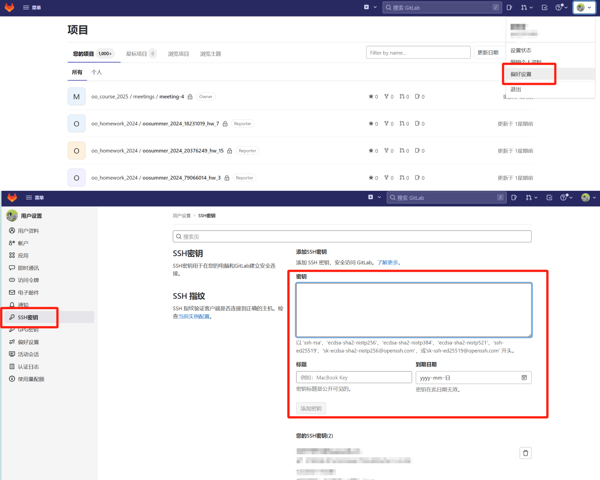

现在，我们已经安装并配置好了我们的 git。我们可以使用命令行来进行 git 的相关操作，也可以使用 IDEA 中自带的 git 工具来进行操作。下面我们对两种方法分别进行介绍。

### step 1 新建仓库

#### 命令行

**在本地新建一个空文件夹，在此目录下打开终端（bash/git bash/powershell/…）**

输入

```bash
git clone 你的个人第一次作业的远程仓库链接
```

（其中个人作业 1 仓库的名字为 ooprehomework\_2024\_你的学号\_hw\_1，个人第一次作业的远程仓库链接进入仓库后可以看见，如下图所示）

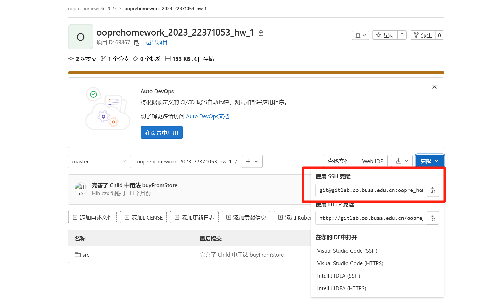

#### IDEA（推荐）

打开 IDEA，选择 **“从版本控制中获取”**。

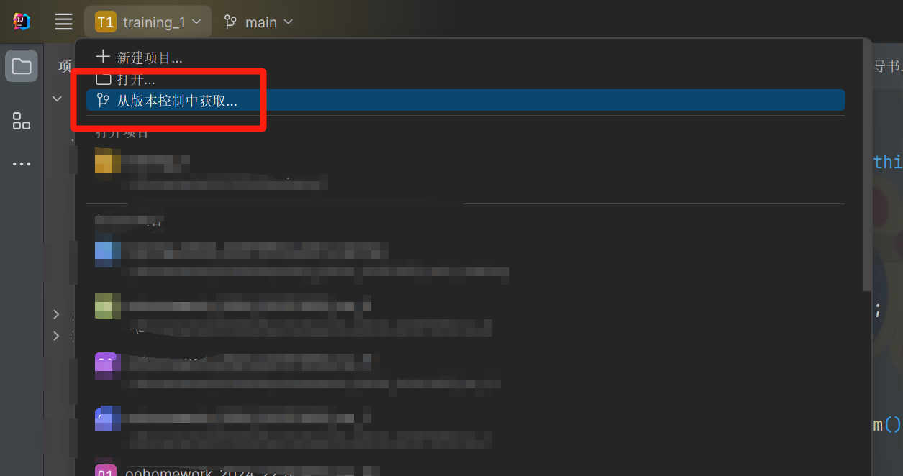

填入作业仓库的远程链接（获取方式与上述相同），点击克隆即可。

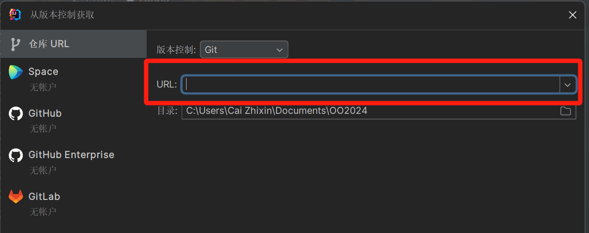

### step 2 尝试一次提交

当你在仓库里进行了更改后，可以进行提交，并推送至远程仓库中。下面两种方式均可，**建议刚上手的同学使用 IDEA 提交**。

#### 命令行提交

在你的仓库目录下

```bash
git add 你要提交的文件
git commit -m "提交消息"
git push
```

#### IDEA提交（推荐）

在 IDEA 中打开项目，点击版本控制，选择 **提交**。

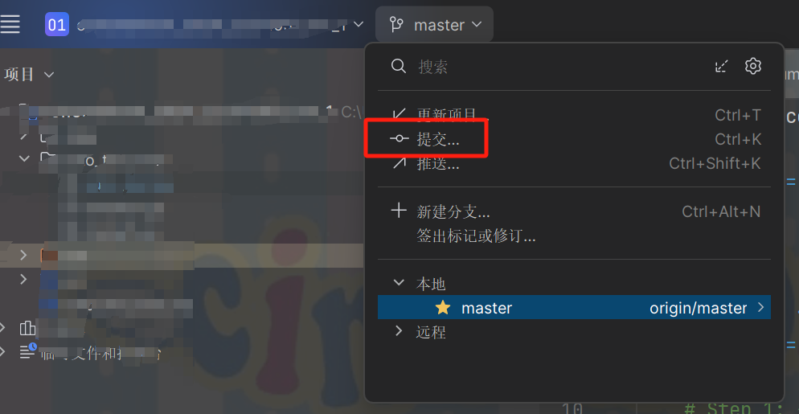

填写本次提交的提交消息，然后点击 **“提交”**。提交后，本次更改将会保存在本地，要将其推送至远程仓库中，需要点击上图中的“推送”。当然，你也可以点击 **“提交并推送”** 来一次性进行两个操作。

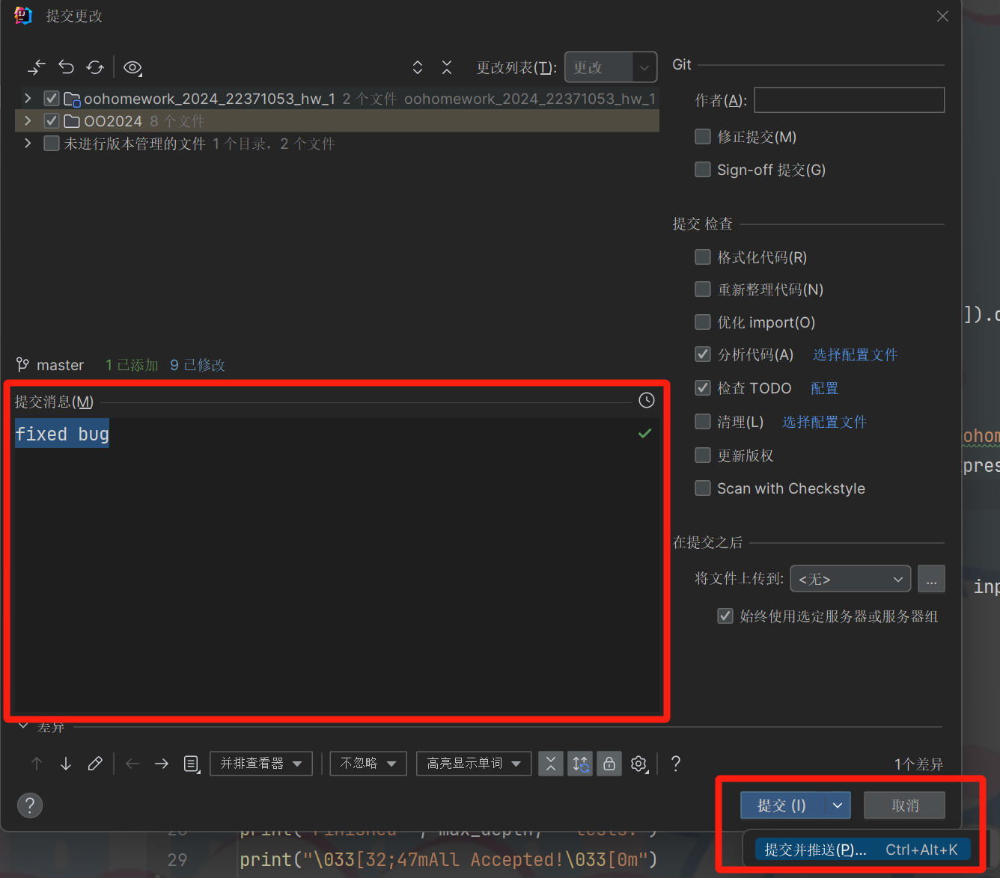

### step 3 提交评测

将本地提交推送到远程仓库后，我们访问 [课程网站](http://oo.buaa.edu.cn/courses)，选择课程和对应的作业，可以在 **评测** 处查看提交列表，并选择一次提交，进行评测。

至此，任务一的内容已全部介绍完毕，如果按照上述步骤操作后得到预期结果（例如可以正常 `pull` 和 `push`），即可开始进行任务二。

### step 4 扩展 Git 功能介绍

git 是一个十分强大的代码管理工具，上文只介绍了 git 的最基本用法，目的是确保同学们能够进行简单的作业提交。然而，在实际生产开发中，很多场景需要用到 git 的其它功能，在此我们做一个初步的简单介绍，同学们在此后的学习中如果遇到相似的场景，可以查阅文档、博客等，借助 git 这一强大的工具，来更高效的解决问题。

#### 1\. 查看历史记录 (Log)

**场景**: 当你需要追踪代码的变化历史，找出特定功能或错误的引入点，或者想了解谁在何时做了什么修改时。

```bash
git log
```

#### 2\. 比较差异 (Diff)

**场景**: 在提交前检查即将提交的更改，或者在任何两个提交之间比较代码差异。

```bash
git diff HEAD^ HEAD # 比较当前提交与前一次提交的差异
git diff master..feature-branch # 比较主分支与功能分支之间的差异
```

#### 3\. 回退更改 (Reset)

**场景**: 如果你意外地提交了不希望提交的更改，或者需要回滚到某个历史版本。

```bash
git reset --hard HEAD^ # 回退到前一次提交
git reset --hard <commit-hash> # 回退到指定的提交
```

#### 4\. 文件恢复 (Checkout)

**场景**: 当你需要恢复单个文件到某个历史状态，或者切换到不同的分支。

```bash
git checkout <commit-hash>^ -- path/to/file # 恢复文件到特定提交的状态
git checkout master # 切换到主分支
```

#### 5\. 分支管理 (Branch)

**场景**: 开发新功能或修复bug时创建独立的分支，避免影响主分支的稳定性。

```bash
git branch feature-branch # 创建新分支
git checkout feature-branch # 切换到新分支
git branch -d feature-branch # 删除分支
```

#### 6\. 合并分支 (Merge)

**场景**: 当你完成了在功能分支上的工作，准备将其合并回主分支或其他分支。

```bash
git merge feature-branch # 将 feature-branch 合并到当前分支
```

## 参考资料

1.  [Git 使用心得 & 常见问题整理](https://juejin.cn/post/6844904191203213326)
2.  [Git 廖雪峰教程](https://www.liaoxuefeng.com/wiki/896043488029600)文档中可以找到相关内容。

## 其他

以上部分仅为练习，不计入作业成绩。

## 任务二：基于给定 Java 代码完成错误的修改

### Part 1. Java 基础知识梳理

> 以下教程的操作与提示全部基于 **IntelliJ IDEA**

#### 一、从 C 到 Java

在本次作业，我们希望同学们能通过实现一系列基础的类，并且熟悉类、属性和方法的使用，从面向过程编程思想迈向面向对象编程思想。

##### Java 编程的模式

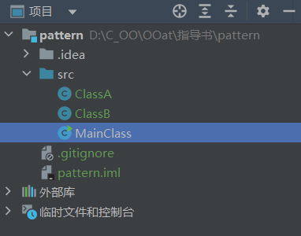

区别于我们之前高级语言程序设计、数据结构课程所使用的基于过程的程序设计方法，即使用一个文件( XXX.c )包含所有代码， 面向对象编程则是将程序分解为一个个的对象，让每个 **类( .java 文件)** 做自己的事情，它将数据和操作数据的函数封装在一起。在程序的最终执行过程中，是消息传递的，即通过类之间的消息传递来实现程序的执行。

##### 程序入口

在刚刚的编程模式的图文讲解中我们出现了 `MainClass` 即 `主类` 的概念，那么 MainClass 究竟又有什么作用呢？

```java
public class MainClass {
    public static void main(String[] argv) {
       /* …… */
       /*coding context*/
       /* …… */
    }
}
```

Java 中的方法 `public static void main(String[] argv)`，就相当于 C 语言的入口函数 `main()` 。这个 `main` 是你 Java 主程序的执行入口，当运行 Java 程序时，你可以理解成将会从此处开始执行。为了方便评测，在 OO 课程中，**请你保证 `public static void main(String[] argv)` 方法出现且只出现在一个类（通常为 `MainClass`）中**。

> 实际应用中，可以有多个类中包含 `main` 方法，我们可以手动指定一个类中的 `main` 方法作为程序入口。

##### hw1 涉及的语法知识

1.  输出
    
    我们向屏幕输出 `Hello World!`：
    
    ```java
    String str = "Hello";
    System.out.println(str + " World!"); 
    // 输出结果: 
    // Hello World!
    ```
    
    在输出过程中可以发现，我们用到了 System 类的一个方法。System 类位于 Java.lang 包，代表当前 Java 程序的运行平台，系统级的很多属性和控制方法都放置在该类的内部。目前同学们可以把它理解为 Java 为我们提供的一系列“库函数”。System 类是一个很特殊的类，我们无法创建该类的对象，即无法实例化该类。但 System 类提供了一系列 **静态的类变量和类方法**，我们可以直接通过 System 类来调用这些类变量和类方法。
    
2.  输入
    
    我们从标准输入读入整数`a`，浮点数`b`，字符串`c` 和 `d`：
    
    ```java
    Scanner scanner = new Scanner(System.in);
    int a = scanner.nextInt(); // 从标准输入读入一个 int 型的数
    double b = scanner.nextDouble(); // 从标准输入读入一个 double 型的数
    String c = scanner.next(); // next 方法以空白符作为分隔从标准输入读入字符串
    String d = scanner.nextLine(); // nextLine 方法以换行符作为分隔从标准输入读入字符串
    // 对于 c 和 d 的读入方式，若分别输入 hello world
    // c = "hello"
    // d = "hello world"
    ```
    
    在输入过程中可以发现，我们用到了 `Scanner` 类，并对他进行了实例化。`Scanner` 类是 Java 的一个内置类，它提供了一种简便的方法从标准输入（System.in）或者文件（FileInputStream）中读取数据类型和字符串的功能。
    
    Scanner 类可以读取`int`、`long`、`float`、`double`和`String`等类型。它还可以使用正则表达式读取符合模式的文本。
    
    Scanner 类提供了一系列的方法来读取不同类型的数据。除了上述我们介绍的几种读取方法，Scanner 类还提供了 `hasNext()` 和 `hasNextLine()` 等方法，用于检测是否还有更多的数据可以读取。
    
    这部分内容对同学们来说或许有些难以理解，可以容后再看，在接触一门新语言时候，我们先掌握他的功能性用法就足够了。
    
    此外，除了这几种用法，Scanner 还有一个叫 `nextLine()` 的方法，你可能会在这次的作业中用到，它们的区别可以参考以下链接：[Java Scanner 类 | 菜鸟教程 (runoob.com)](https://www.runoob.com/java/java-scanner-class.html)
    
    值得注意的是，在今后的学习中，同学们还会遇到很多无法靠名字准确识别功能的方法，这时候就需要大家查阅资料或者翻看其具体实现，避免因为认识不清而导致的 bug
    
3.  `if-else`, `switch-case`,`for`,`while` 等关键字的用法和 C 是相同的。
    

##### 错误处理

1.  编写程序时的错误:
    
    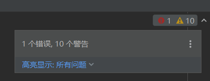
    
    当类右上角出现红色感叹号证明编写程序有误，无法通过编译，可点击右上角红色感叹号观察对应错误信息并进行修改。
    
2.  程序执行时的错误：
    
    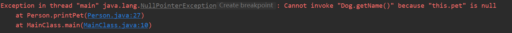
    
    当程序已经通过编译，在执行时出现错误，可以点击对应报错部分的蓝色高亮区域跳转到出错位置，idea会有浮动窗口显示可能的错误原因，方便同学修改代码。
    
3.  常见编译错误
    

+   **…… Expected**

```java
System.out.println("缺少分号") // !
System.out.println("缺一半括号"; // !
```

+   **Unclosed String Literal** 这类编译错误出现的原因大概率是你的字符串缺少了 **”**

```java
System.out.println("缺少一半引号); // !
```

+   **Cannot Find Symbol** 这类编译错误出现的原因主要是使用了未定义的变量。例如：标识符声明时的拼写可能与代码中使用时的拼写不一致；变量从未被声明；未在同一作用域内声明该变量；没有导入类

```java
int defined = 3;
int result = define - i; // !
```

```java
int sum = 0;
for (int i = 0 ; i < 3; i++) {
    sum += i*i;
}
i++; // !
```

+   **Missing Return Statement** 编译器抛出该问题的可能性有：返回语句被错误地省略了；该方法没有返回任何值，但是在方法声明中未声明类型为void

```java
public int add(int a, int b) {
    int sum = a + b;
}    
```

```java
public int add(int a) {
    int b = -1;
    if (b > 0) {
        return a + b;
    }
}    
```

+   **Non-Static Method … Cannot Be Referenced From a Static Context** 当编译器抛出这个问题的时候，意味着代码存在 **从静态上下文中引用非静态变量**

```java
public class StaticTest {  
    private int count=0;  
    public static void main(String args[]) throws IOException {  
        count++; // !
    }  
} 
```

+   **Non-Static Method … Cannot Be Referenced From a Static Context** 当编译器抛出这个问题的时候，意味着代码 **尝试在静态类中调用非静态方法**

```java
class Sample {  
   private int age;  
   public int getAge()  
   {  
      return age;  
   }  
   public static void main(String args[])  
   {  
       System.out.println("Age is:"+ getAge());  
   }  
}  
```

+   **Constructor in class cannot be applied to given types** 当编译器抛出该类问题的时候，代码中可能出现了构造函数有错误的返回类型；创建类对象的时候参数和构造函数的参数不匹配。

```java
public class Constructor1 {
    private int a;
    public void Constructor1(int a) {
        this.a = a;
    }
}

public class Constructor2 {
    private int a;
    public Constructor2() {
        this.a = 100;
    }    
}   

public class Test {
    public static void main(String args[]) {
        Constructor1 c1 = new Constructor1(3); 
        Constructor2 c2 = new Constructor2(3); // !
    }
}    
```

+   **Cannot access private property** 当编译器抛出这类问题的时候，说明代码中出现了一个类中的私有属性/私有方法被外部类访问的情况

```java
public class Private {
    private int a;
    public Private() {
        a = 1024;
    }    
    private void modify() {
        a = a / 2;
    }    
}     

public class Other {
    public void test() {
        Private p = new Private();
        P.a = 3; // !
    }
    public static void main(String args[]) {
        Private p = new Private();
        p.modify(); // !
    }       
}        
```

#### 二、构造一个类

接下来我们来讨论一下，上文提到了很多次的 **"类"** 打个比方，如果说我们现在需要设计一个**宠物商店**。宠物商店里一定有狗，那么我们就新建一个 `Dog` 类：

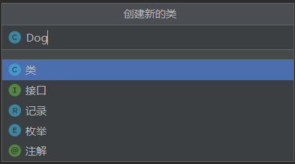

我们回忆C语言的结构体，如果小狗是一个结构体……

```c
struct Dog {
    char name[30];
    char type[30];
    int age;
    double price;
    int isBought; //0 for on sale, 1 for saled
};
```

在 Java 中，小狗是……

```java
//Dog 类
public class Dog {
    //属性
    private String name;
    private String type;
    private int age;
    private double price;
    private boolean isBought;

    //方法
    public double getPrice() {
        return price;
    }

    public void setBought(boolean bought) {
        this.isBought = bought;
    }

    public void addAge() {
        this.age++;
    }
}
```

##### 属性

对比 C - Java ，我们发现，姓名、年龄、价格这些曾经作为结构体的**结构变量**的内容，会成为类中的**属性**。

所有属性均是私有→**private** 的，外部完全看不到它们。我们这里可以理解为，比如说现在又有一个新的**Person**类，那这个人如果想要直接 **修改** 或 **看见** 小狗的价格是不可以的。他必须通过调用 Dog 类的 `getPrice()` 方法才能看到小狗的价格，同时调用小狗的 `setBought()` 方法来修改小狗是否已经被卖出的情况。

面向对象开发强调封装和私有保护，我们一般不允许把属性定义成 public 的。面向对象方法的基本特点是私有化保护内部数据，暴露对数据的必要操作接口，即可以提供 `setter-getter` 方法。但是需要注意，如果对于全部的属性都无脑设置配套的 get+set ，那么将成员属性设置成 private 的意义就不大了。

> 功能提示：在类中按 **alt+insert** 按键可弹出如下窗口（Mac 操作系统下为 **Command+N**，提供更便捷的添加构造方法，`setter-getter` 方法等。
> 
> 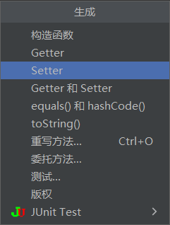

##### 方法

对比 C - Java ,我们发现 Java 方法类似于 C 的函数，是一段用来完成特定功能的代码片段。 和均为 **private** 的所有属性不同，部分类内方法需要暴露对类内属性的必要操作接口，因此需要其修饰符应设定成 **public** 。比如给小狗增加年龄的这个方法，他可以被一个计时器类调用，从而实现给小狗进行年龄增长的操作。

#### 三、实例化

现在我们的宠物商店有了dog的"模板"，但事实上，宠物商店应当有的是真正的小狗，而非小狗的概念，因此，我们还需要在宠物商店中创造一个真正存在的小狗，当然，为了更好的表达和这个小狗有关的事物，我们需要通过一个“名称”来指代这只小狗，这个名称，在java中，叫做 **引用**。

对比 C 语言和 Java 语言

```c
void initial(struct Dog* dog, char name[30], char type[30], int age, double price) {
    strcpy(dog->name, name);
    strcpy(dog->type, type);
    dog->age = age;
    dog->price = price;
    dog->isBought = 0;
}

int main() {
    struct Dog dog; 
    // 初始化
    initial(&dog, "puppy", "Bernese Montain", 1, 18000);
    // 购买
    struct Person person = {"小明"};
    buy(&dog, &person);
}
```

```java
//在Dog 类
public class Dog {
    //成员变量们
    public Dog(String name, String type, int age, double price) {
        this.name = name;
        this.type = type;
        this.age = age;
        this.price = price;
        this.isBought = false;
    }
    //方法们
}

//在MainClass 类
public class MainClass {
    public static void main(String[] args) {
        Dog dog;
        dog = new Dog("puppy","Bernese Mountain", 1, 18000);
        Person person = new Person("小明");
        person.buy(dog);
    }
}
```

我们发现对于 Java 语言，**Dog** 形如 `int`、`char` 等类型的变量类型。 于是我们就可以使用这条语句：`Dog dog;` 来声明一个 `Dog` 型的变量`dog`了。

对比 C-Java ，Java 里引用类型的**变量**类似于 C 语言中的一个结构体**指针**，如果不对其进行**初始化**或执行任何**赋值**等操作，那么这个变量就会指向一个 `null` 量，代表这是一个空引用/空指针，此时还没有任何内存空间被分配用于存储对象的信息。

> 在Java中，数据类型分为基础数据类型和引用类型：
> 
> +   **基础数据类型**是存储简单数据值的变量，如 `boolean`、`int`、`double`、`char`；
> +   **引用类型**是指对象的引用，它们可以指向任意复杂的数据结构。如数组、类和接口。
> 
> 基础数据类型的变量在声明时会直接被赋予默认初始值，而不会指向 `null`。

在**本段**代码中，如果我们不使用**构造函数** new 出来一个新的小狗，那么此时这个 dog 也是一个 null 量。 和 `initial()` 函数作用类似的 `public Dog()` 名为构造函数，它的用途是在你需要创建一个对象的时候完成一些初始化工作，即给对象的属性赋予初始值。

我们推荐在所有主类以外的类中都显式写出形如 `public 类名 (参数列表){}` 的构造函数。

### Part 2. 任务描述

#### 作业要求

课程组在本次作业对应的 git 仓库中提供了一份 **有错误** 的代码，你需要对代码进行修改，使程序能够正确的完成上面的场景逻辑。完成代码的修改后，你需要将代码提交到 hw1 的评测窗口，并且通过所有测试点

#### 背景描述

欢迎来到虚拟宠物乐园！你是一位宠物爱好者，初始经验值为 0，你拥有一只可爱的虚拟宠物，宠物拥有 **名字、饥饿度、快乐度和健康度** 四种属性信息。你的任务是照顾好它，确保它不会太饿、太不开心或者太不健康。你可以给它喂食不同的食物来降低它的饥饿度，也可以陪它玩耍来提高它的快乐度。但是要小心，过度喂食可能会降低宠物的健康度！

具体的，我们做出如下约定：

1.  有两种食物 biscuit 和 fruit 可供喂食，每次喂食后，**玩家经验值增加 5 点**
    +   biscuit：喂食 biscuit 后，宠物的 **饥饿度降低 10 点**
    +   fruit：喂食 fruit 后，宠物的 **饥饿度降低 8 点**
    +   特殊的，当宠物被喂食超过 **3** 次 biscuit 后，每次喂食 biscuit（从第 4 次开始）后，饥饿度降低 10 点的同时，**健康度降低 5 点**
2.  陪宠物进行一次玩耍，**宠物的快乐度升高 5 点**，**玩家经验值增加 7 点**
3.  宠物的饥饿度和健康度不得低于 0，快乐度不得高于 100。如果某次操作使得宠物的饥饿度或健康度小于 0，则宠物的饥饿度或健康度视为 0；如果某次操作使得宠物的快乐度超过 100，则宠物的快乐度视为 100。

#### 输入要求

游戏开始时，你会收到一个虚拟宠物的名字和它的初始饥饿度、快乐度和健康度。

第 $1$ 行一个字符串，表示虚拟宠物的名字；第 $2,3,4$ 行一行一个非负整数，依次表示虚拟宠物的初始饥饿度、快乐度和健康度。

从第 $5$ 行开始，你将从标准输入读取一系列指令，直到遇到结束指令为止。每个指令可以是以下几种之一：

+   `feed <food_name>`: 给宠物喂食某种食物（food\_name 只可能为 `biscuit` 和 `fruit` 其中之一）。
+   `play`: 和宠物一起玩耍。
+   `status`: 查看宠物的当前状态。
+   `quit`: 结束游戏。

数据保证指令数不超过 $200$ 条。

#### 输出要求

对于每个 `status` 指令，你需要输出宠物的当前状态，格式为：

```
<pet_name>:
Hunger: <hunger>
Happiness: <happiness>
Health: <health>
```

其中`<pet_name>`是宠物的名字，`<hunger>`、`<happiness>`和`<health>`分别是宠物的饥饿度、快乐度和健康度。

当游戏结束（即遇到`quit`指令），你需要输出最终状态和一条告别消息：

```
<pet_name>:
Final Hunger: <hunger>
Final Happiness: <happiness>
Final Health: <health>

Final Player Exp: <exp>

Thank you for playing!
```

**注意，输出的内容在我们所给的代码中是正确完成的，同学们不修改 `System.out` 相关的内容即可。**

#### 样例

##### 输入样例 1

```text
dog
10
10
10
feed fruit
play
status
feed biscuit
quit
```

##### 输出样例 1

```text
dog:
Hunger: 2
Happiness: 15
Health: 10

dog:
Hunger: 0
Happiness: 15
Health: 10

Final Player Exp: 17

Thank you for playing!
```

##### 输入样例 2

```text
dog
100
100
100
feed biscuit
feed biscuit
feed biscuit
feed biscuit
feed biscuit
quit
```

##### 输出样例 2

```text
dog:
Hunger: 50
Happiness: 100
Health: 90

Final Player Exp: 25

Thank you for playing!
```